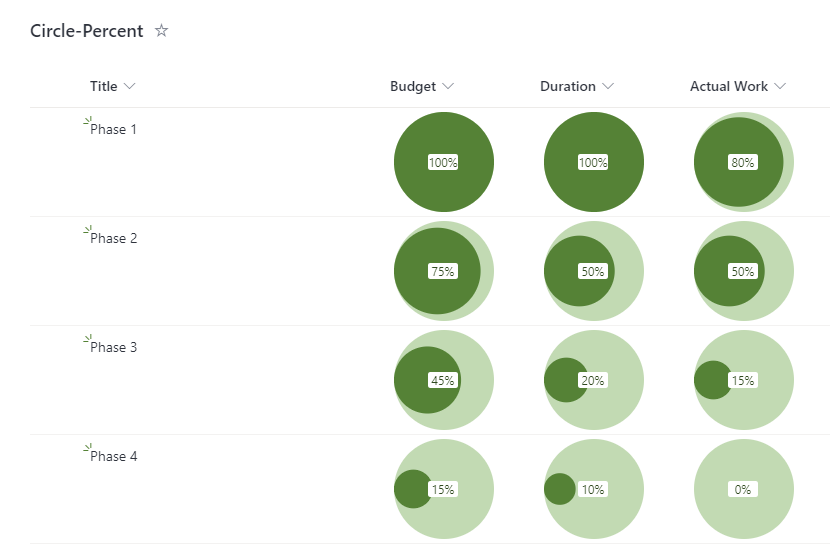

# Liczba Circle in Circle

## Podsumowanie
Ta próbka pokazuje how the percentage value in a column can be displayed as the area of a circle within another circle.

## Wymagania widoku
- Ten format można zastosować do a Liczba column. It is expected that the values will be from 0 to 1 (percent)

## Przykład

Rozwiązanie|Autor(zy)
--------|---------
number-circle-in-circle.json | [Geert de Kooter](https://github.com/gdk-max)

## Historia wersji

Wersja|Data|Uwagi
-------|----|--------
1.0|14 listopada 2021|Wersja początkowa

## Zastrzeżenie
**TEN KOD JEST DOSTARCZANY W STANIE *TAKIM, W JAKIM JEST*, BEZ JAKIEJKOLWIEK GWARANCJI, WYRAŹNEJ ANI DOROZUMIANEJ, W TYM TAKŻE DOROZUMIANYCH GWARANCJI PRZYDATNOŚCI DO OKREŚLONEGO CELU, WARTOŚCI HANDLOWEJ ANI NIENARUSZANIA PRAW.**

---

## Dodatkowe uwagi
Brak

