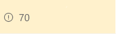

# Minimum Value Highlight

## Podsumowanie
This example uses the conditional operator `?` to apply a class (`sp-field-severity--warning`) to the parent `
` element when the  value in the current field is less than or equal to 70.  This causes the field to be highlighted when the value is less than or equal to 70, and appear normally if it's greater than 70.

## Wymagania widoku
- Ten format można zastosować do a Number column

## Przykład

Rozwiązanie|Autor(zy)
--------|---------
number-conditional-format.json | [SharePoint Team](https://github.com/SharePoint)

## Historia wersji

Wersja|Data|Uwagi
-------|----|--------
1.0|November 2, 2017|Wersja początkowa
1.1|August 20, 2018|Switched to Excel-style expressions

## Zastrzeżenie
**TEN KOD JEST DOSTARCZANY W STANIE *TAKIM, W JAKIM JEST*, BEZ JAKIEJKOLWIEK GWARANCJI, WYRAŹNEJ ANI DOROZUMIANEJ, W TYM TAKŻE DOROZUMIANYCH GWARANCJI PRZYDATNOŚCI DO OKREŚLONEGO CELU, WARTOŚCI HANDLOWEJ ANI NIENARUSZANIA PRAW.**

---

## Dodatkowe uwagi
Ta próbka jest również opisana w głównej dokumentacji dotyczącej formatowania kolumn

- [Użyj formatowania kolumn do dostosowania SharePoint](https://docs.microsoft.com/en-us/sharepoint/dev/declarative-customization/column-formatting)

> An additional version using Abstract Tree Syntax (AST) is also provided for environments where the Excel-style expressions are not supported.

