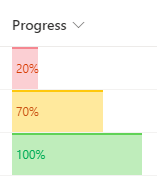

# Conditional Progress Color

## Podsumowanie
Ta próbka pokazuje displaying progress bar with conditional color based on the value.
- Red for value <= 0.3 (30%)
- Yellow for 0.3 (30%) < value < 1 (100%)
- Green for value == 1 (100%)

## Wymagania widoku
- Ten format można zastosować do a Liczba column. It is expected that the values will be from 0 to 1 (percent)

## Przykład

Rozwiązanie|Autor(zy)
--------|---------
number-conditional-progress-color.json | [Ari Gunawan](https://github.com/AriGunawan)

## Historia wersji

Wersja|Data|Uwagi
-------|----|--------
1.0|9 października 2021|Wersja początkowa

## Zastrzeżenie
**TEN KOD JEST DOSTARCZANY W STANIE *TAKIM, W JAKIM JEST*, BEZ JAKIEJKOLWIEK GWARANCJI, WYRAŹNEJ ANI DOROZUMIANEJ, W TYM TAKŻE DOROZUMIANYCH GWARANCJI PRZYDATNOŚCI DO OKREŚLONEGO CELU, WARTOŚCI HANDLOWEJ ANI NIENARUSZANIA PRAW.**

---

## Dodatkowe uwagi

- [Użyj formatowania kolumn do dostosowania SharePoint](https://docs.microsoft.com/en-us/sharepoint/dev/declarative-customization/column-formatting)

