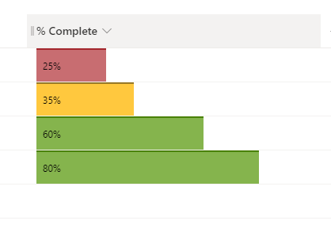

# Multi-Colored Databars

## Podsumowanie

Ta próbka formatowania kolumn demonstrates how to show the number column as data bars with multiple colors. Background color changes depending on the value: 

Value                       |Color
----------------------------|---------------------------
0% - 25% |Red
26% - 50% |Yellow
51% - 100% |Green

Ta próbka pochodzi z [number-data-bar](https://github.com/pnp/List-Formatting/tree/master/column-samples/number-data-bar).

## Wymagania widoku

Ten format można zastosować do a Liczba column. It is expected that the values will be from 0 to 1 (percent).

## Przykład

Rozwiązanie|Autor(zy)
--------|---------
number-data-bar-multi-color.json | [Ganesh Sanap](https://github.com/ganesh-sanap)

## Historia wersji

Wersja |Data          |Uwagi
--------|--------------|--------------------------------
1.0     |grudnia 29, 2021 |Wersja początkowa

## Zastrzeżenie

**TEN KOD JEST DOSTARCZANY W STANIE *TAKIM, W JAKIM JEST*, BEZ JAKIEJKOLWIEK GWARANCJI, WYRAŹNEJ ANI DOROZUMIANEJ, W TYM TAKŻE DOROZUMIANYCH GWARANCJI PRZYDATNOŚCI DO OKREŚLONEGO CELU, WARTOŚCI HANDLOWEJ ANI NIENARUSZANIA PRAW.**

