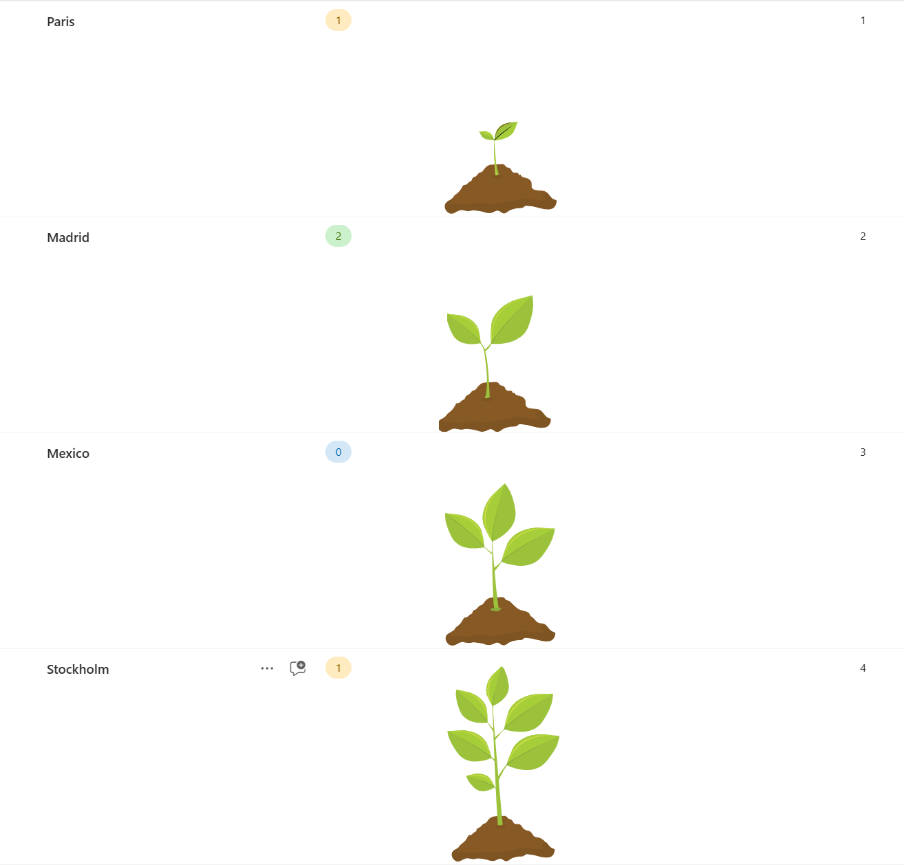

# Format a column with multi-path SVGs

## Podsumowanie

Ten format stosuje różne SVG z wieloma ścieżkami do pola liczbowego, zależnie od jego wartości. Pole może zawierać liczby `1`, `2`, `3` lub `4`.

This solution provides a visually appealing way to represent progress using custom SVG graphics. Formatting dynamically changes the displayed SVG based on the value in a "Progress" column.

## Features

* Custom SVG graphics for different progress stages
* Dynamic display based on a "Progress" field value
* Supports up to 4 different progress stages
* Easily customizable SVG paths and colors

Próbka includes conditional formatting that displays different SVGs based on the value in the "Progress" column:

| Value| Stage |
|----------|----------|
|Progress value 1   | Displays the first stage SVG |
|Progress value 2   |  Displays the second stage SVG  |
|Progress value 3  |  Displays the third stage SVG  |
|Progress value 4  | VDisplays the fourth stage SVG  |

If the Progress field is empty or has any other value, no SVG will be displayed.

## Wymagania widoku

- Ten format można zastosować do a number column with values 1-4

## Przykład

Rozwiązanie|Autor(zy)
--------|---------
number-data-plant.json | [Luise Freese](https://github.com/LuiseFreese)

## Historia wersji

Wersja|Data|Uwagi
-------|----|--------
1.0|October 8, 2024|Wersja początkowa

## Zastrzeżenie
**TEN KOD JEST DOSTARCZANY W STANIE *TAKIM, W JAKIM JEST*, BEZ JAKIEJKOLWIEK GWARANCJI, WYRAŹNEJ ANI DOROZUMIANEJ, W TYM TAKŻE DOROZUMIANYCH GWARANCJI PRZYDATNOŚCI DO OKREŚLONEGO CELU, WARTOŚCI HANDLOWEJ ANI NIENARUSZANIA PRAW.**

