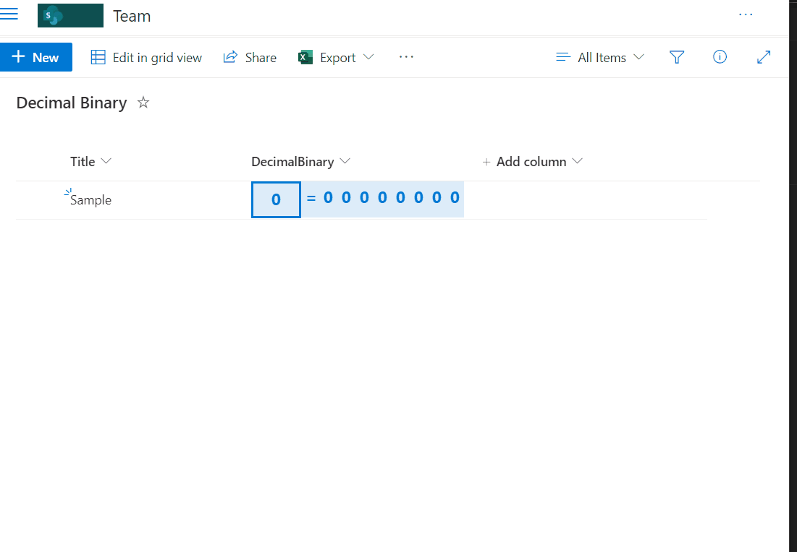

# Decimal to Binary Conversion

## Podsumowanie
Ta próbka przedstawia decimal conversion to binary using standard List formatting math functions.

## Wymagania widoku
- Format expect the following fields:

Field |Type
--------|---------
DecimalBinary | Number- Define min value of 0 and max value of 255.

## Przykład

Rozwiązanie|Autor(zy)
--------|---------
number-decimal-binary.json | [André Lage](https://github.com/aaclage)

## Historia wersji

Wersja|Data|Uwagi
-------|----|--------
1.0|April 04, 2022|Wersja początkowa

## Zastrzeżenie
**TEN KOD JEST DOSTARCZANY W STANIE *TAKIM, W JAKIM JEST*, BEZ JAKIEJKOLWIEK GWARANCJI, WYRAŹNEJ ANI DOROZUMIANEJ, W TYM TAKŻE DOROZUMIANYCH GWARANCJI PRZYDATNOŚCI DO OKREŚLONEGO CELU, WARTOŚCI HANDLOWEJ ANI NIENARUSZANIA PRAW.**

