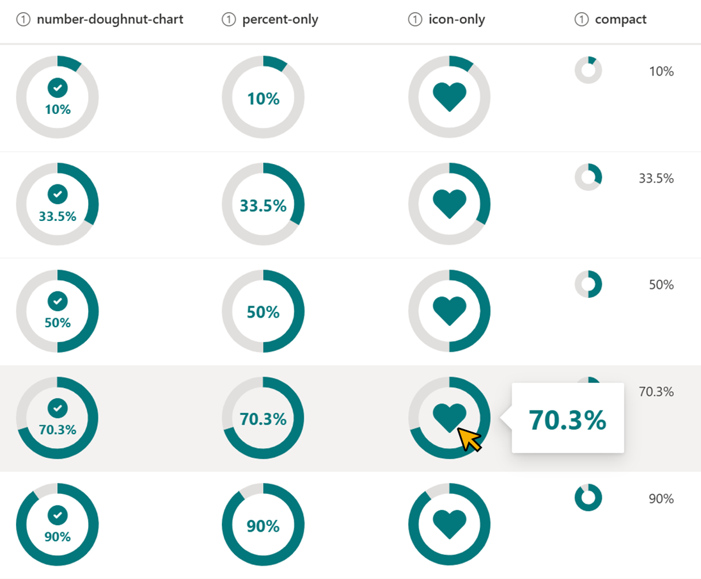

# Zróbughnut Chart

## Podsumowanie
Ta próbka zmienia wygląd wartości w kolumnach liczbowych (procentowych) na wykres pierścieniowy. Wykres jest wyświetlany przy użyciu `svg`.

## Wymagania widoku
Ten format można zastosować do a Liczba column. It is expected that the values will be from 0 to 1 (percent).

## Przykład

Rozwiązanie|Autor(zy)
--------|---------
number-doughnut-chart.json | [Tetsuya Kawahara](https://github.com/tecchan1107)
number-doughnut-chart-percent-only.json | [Tetsuya Kawahara](https://github.com/tecchan1107)
number-doughnut-chart-icon-only.json    | [Tetsuya Kawahara](https://github.com/tecchan1107)
number-doughnut-chart-compact.json    | [Tetsuya Kawahara](https://github.com/tecchan1107)

## Historia wersji

Wersja |Data            |Uwagi
--------|----------------|----------------
1.0     |sierpnia 20, 2021 |Wersja początkowa
1.1     |października 3, 2021 |Poprawiono the display when the value is less than 0% and greater than 100%.
1.2     |kwietnia 12, 2025 |Dodano `number-doughnut-chart-compact.json`

## Zastrzeżenie
**TEN KOD JEST DOSTARCZANY W STANIE *TAKIM, W JAKIM JEST*, BEZ JAKIEJKOLWIEK GWARANCJI, WYRAŹNEJ ANI DOROZUMIANEJ, W TYM TAKŻE DOROZUMIANYCH GWARANCJI PRZYDATNOŚCI DO OKREŚLONEGO CELU, WARTOŚCI HANDLOWEJ ANI NIENARUSZANIA PRAW.**

---

## Dodatkowe uwagi
Ta próbka wykorzystuje icons from the Fluent UI

- [Fluent UI](https://developer.microsoft.com/en-us/fluentui)

