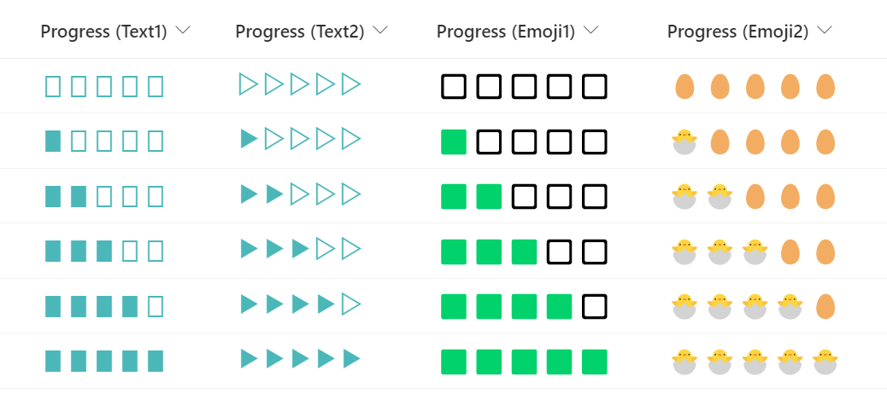

# Pasek postępu z użyciem tekstu lub emoji

## Podsumowanie
Ta próbka pokazuje how to display a progress bar by repeating text or emoji using the `padStart` operator.

`padStart` is an operator that embeds a character string with another character string until the specified length is reached. However, if you specify a emoji as the embedding character, **the emoji is counted as 2 characters**, so you need to be careful how to set the specified length.

- `"txtContent":"=padStart('Dog', 7, 'A')"` results in `AAAADog`
- `"txtContent":"=padStart('Dog', 7, '🐶')"` results in `🐶🐶Dog`
- `"txtContent":"=padStart('', 10, 'C')"` results in `CCCCCCCCCC`
- `"txtContent":"=padStart('', 10, '😺')"` results in `😺😺😺😺😺`

## Wymagania widoku
Ten format można zastosować do a Liczba column (the format expects values from 0-5)

## Przykład

Rozwiązanie|Autor(zy)
--------|---------
number-emoji-progressbar.json | [Tetsuya Kawahara](https://github.com/tecchan1107)
number-emoji-progressbar.json | [Tetsuya Kawahara](https://github.com/tecchan1107)

## Historia wersji

Wersja |Data             |Uwagi
--------|-----------------|--------
1.0     |stycznia 16, 2022 |Wersja początkowa

## Zastrzeżenie
**TEN KOD JEST DOSTARCZANY W STANIE *TAKIM, W JAKIM JEST*, BEZ JAKIEJKOLWIEK GWARANCJI, WYRAŹNEJ ANI DOROZUMIANEJ, W TYM TAKŻE DOROZUMIANYCH GWARANCJI PRZYDATNOŚCI DO OKREŚLONEGO CELU, WARTOŚCI HANDLOWEJ ANI NIENARUSZANIA PRAW.**

