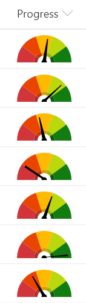
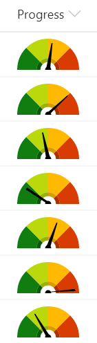

# Liczba Gauge

## Podsumowanie
Ta próbka pokazuje combining a fixed SVG (gauge background) with a dynamic SVG (needle). It makes understanding number columns (percent) very intuitive.

An alternate version (number-gauge-reversed) has been provided for scenarios where the gauge background should be reversed (green to red).

## Wymagania widoku
- Ten format można zastosować do a Liczba column. It is expected that the values will be from 0 to 1 (percent)

## Przykład

Rozwiązanie|Autor(zy)
--------|---------
number-gauge.json | [Chris Kent](https://github.com/thechriskent)
number-gauge-reversed.json | [Chris Kent](https://github.com/thechriskent)

## Historia wersji

Wersja|Data|Uwagi
-------|----|--------
1.0|10 lipca 2019|Wersja początkowa

## Zastrzeżenie
**TEN KOD JEST DOSTARCZANY W STANIE *TAKIM, W JAKIM JEST*, BEZ JAKIEJKOLWIEK GWARANCJI, WYRAŹNEJ ANI DOROZUMIANEJ, W TYM TAKŻE DOROZUMIANYCH GWARANCJI PRZYDATNOŚCI DO OKREŚLONEGO CELU, WARTOŚCI HANDLOWEJ ANI NIENARUSZANIA PRAW.**

---

## Dodatkowe uwagi

- [Użyj formatowania kolumn do dostosowania SharePoint](https://docs.microsoft.com/en-us/sharepoint/dev/declarative-customization/column-formatting)

