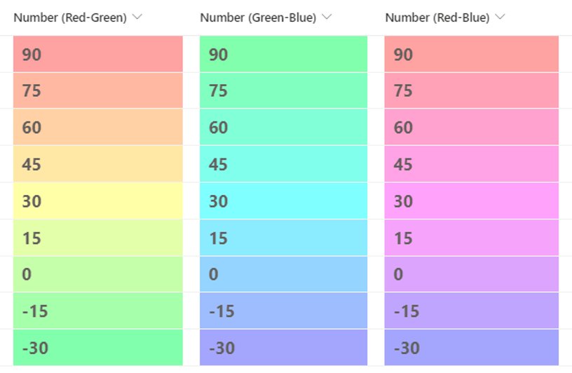

# Liczba Gradation

## Podsumowanie
Ta próbka pokazuje a gradual background color change between the minimum and maximum values. In this sample, the minimum value is -30 and the maximum value is 90.

## Wymagania widoku
Ten format można zastosować do a Liczba column. It is expected that the values will be from -30 to 90.

## Przykład

Rozwiązanie|Autor(zy)
--------|---------
number-gradation.json | [Tetsuya Kawahara](https://github.com/tecchan1107)
number-gradation-green-blue.json | [Tetsuya Kawahara](https://github.com/tecchan1107)
number-gradation-red-blue.json | [Tetsuya Kawahara](https://github.com/tecchan1107)

## Historia wersji

Wersja |Data          |Uwagi
--------|--------------|----------------
1.0     |kwietnia 8, 2022 |Wersja początkowa

## Zastrzeżenie
**TEN KOD JEST DOSTARCZANY W STANIE *TAKIM, W JAKIM JEST*, BEZ JAKIEJKOLWIEK GWARANCJI, WYRAŹNEJ ANI DOROZUMIANEJ, W TYM TAKŻE DOROZUMIANYCH GWARANCJI PRZYDATNOŚCI DO OKREŚLONEGO CELU, WARTOŚCI HANDLOWEJ ANI NIENARUSZANIA PRAW.**

