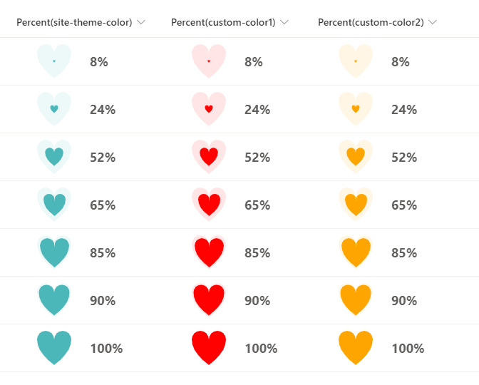

# Heart in Heart

## Podsumowanie
Ta próbka pokazuje how to change the size of a heart by using the percent value of a numeric column.

- `number-heart-in-heart.json` uses the theme color of the site as the color of the heart.
- `number-heart-in-heart-custom-color.json` uses the HTML color code as the the color of the heart, and in the sample, `#FF0000` is set.

## Wymagania widoku
Ten format można zastosować do a Number column. It is expected that the values will be from 0 to 1 (percent).

## Przykład

Rozwiązanie|Autor(zy)
--------|---------
number-heart-in-heart.json | [Tetsuya Kawahara](https://github.com/tecchan1107)
number-heart-in-heart-custom-color.json | [Tetsuya Kawahara](https://github.com/tecchan1107)

## Historia wersji

Wersja |Data              |Uwagi
--------|------------------|--------
1.0     |February 13, 2022 |Wersja początkowa

## Zastrzeżenie
**TEN KOD JEST DOSTARCZANY W STANIE *TAKIM, W JAKIM JEST*, BEZ JAKIEJKOLWIEK GWARANCJI, WYRAŹNEJ ANI DOROZUMIANEJ, W TYM TAKŻE DOROZUMIANYCH GWARANCJI PRZYDATNOŚCI DO OKREŚLONEGO CELU, WARTOŚCI HANDLOWEJ ANI NIENARUSZANIA PRAW.**

---

## Dodatkowe uwagi

The SVG heart in this sample is based on a sample from the following site.

- [d - SVG: Scalable Vector Graphics | MDN](https://developer.mozilla.org/en-US/docs/Web/SVG/Attribute/d)

