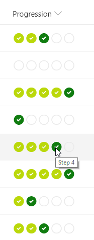

# Icon Progress Bar

## Podsumowanie
Ta próbka pokazuje creating a progress bar using icons. The number column represents the stage in a process and the format provides a visual indicator of where an item is in relation to the process by showing the previous steps as completed, highlighting the current step, and indicating which steps remain.

## Wymagania widoku
- Ten format można zastosować do a Number column (the format expects values from 0-5, but can easily be adjusted to account for more)

## Przykład

Rozwiązanie|Autor(zy)
--------|---------
number-icon-progressbar.json | [Julien Seguin](https://twitter.com/julien_seguin)

## Historia wersji

Wersja|Data|Uwagi
-------|----|--------
1.0|March 1, 2019|Wersja początkowa

## Zastrzeżenie
**TEN KOD JEST DOSTARCZANY W STANIE *TAKIM, W JAKIM JEST*, BEZ JAKIEJKOLWIEK GWARANCJI, WYRAŹNEJ ANI DOROZUMIANEJ, W TYM TAKŻE DOROZUMIANYCH GWARANCJI PRZYDATNOŚCI DO OKREŚLONEGO CELU, WARTOŚCI HANDLOWEJ ANI NIENARUSZANIA PRAW.**

---

## Dodatkowe uwagi
- [Użyj formatowania kolumn do dostosowania SharePoint](https://docs.microsoft.com/en-us/sharepoint/dev/declarative-customization/column-formatting)

