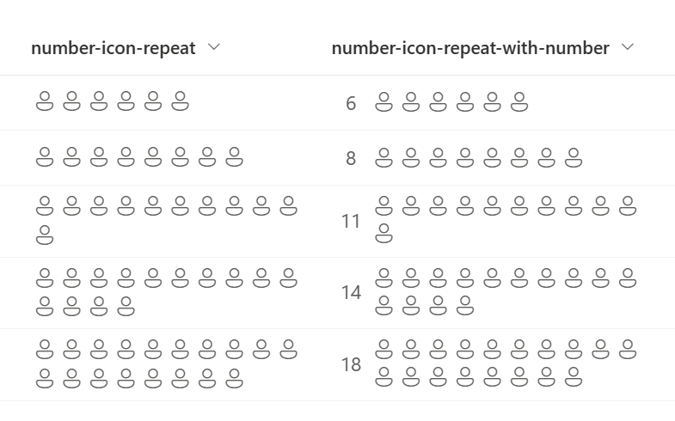
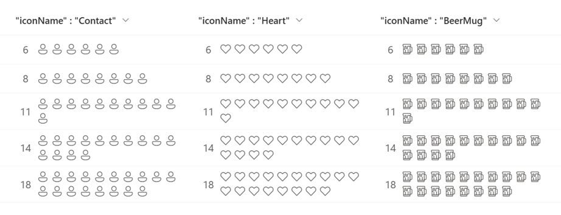

# Wyświetlanie ikon przez powtarzanie

## Podsumowanie
Ta próbka pokazuje the use of the `padStart` and `split` operators to repeatedly display icons for the number of values in the number column.

It also uses [Fluent UI Icons](https://developer.microsoft.com/en-us/fluentui#/styles/web/icons), and by changing the `iconName` property, the icons to be displayed can be changed.

## Wymagania widoku
Ten format można zastosować do a Liczba column.

## Przykład

Rozwiązanie|Autor(zy)
--------|---------
number-icon-repeat.json | [Tetsuya Kawahara](https://github.com/tecchan1107)
number-icon-repeat-with-number.json | [Tetsuya Kawahara](https://github.com/tecchan1107)

## Historia wersji

Wersja |Data             |Uwagi
--------|-----------------|----------------
1.0     |stycznia 14, 2023 |Wersja początkowa

## Zastrzeżenie
**TEN KOD JEST DOSTARCZANY W STANIE *TAKIM, W JAKIM JEST*, BEZ JAKIEJKOLWIEK GWARANCJI, WYRAŹNEJ ANI DOROZUMIANEJ, W TYM TAKŻE DOROZUMIANYCH GWARANCJI PRZYDATNOŚCI DO OKREŚLONEGO CELU, WARTOŚCI HANDLOWEJ ANI NIENARUSZANIA PRAW.**

