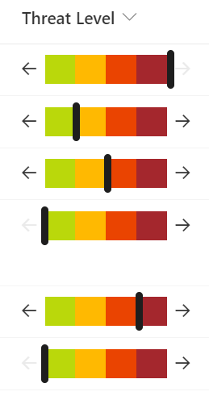

# Number Level Bar

## Podsumowanie
Ta próbka pokazuje displaying a percentage across a bar. End users are able to edit the values by increasing/decreasing in 25% increments using arrow buttons.

## Wymagania widoku

Ten format można zastosować do any number column. It expects the values to be percents (0-1) but the format could be adjusted for custom ranges by changing the expressions.

## Przykład

Rozwiązanie|Autor(zy)
--------|---------
number-level-bar.json | [Chris Kent](https://github.com/thechriskent)

## Historia wersji

Wersja|Data|Uwagi
-------|----|--------
1.0|May 12, 2022|Wersja początkowa

## Zastrzeżenie
**TEN KOD JEST DOSTARCZANY W STANIE *TAKIM, W JAKIM JEST*, BEZ JAKIEJKOLWIEK GWARANCJI, WYRAŹNEJ ANI DOROZUMIANEJ, W TYM TAKŻE DOROZUMIANYCH GWARANCJI PRZYDATNOŚCI DO OKREŚLONEGO CELU, WARTOŚCI HANDLOWEJ ANI NIENARUSZANIA PRAW.**

---

## Dodatkowe uwagi

- [Użyj formatowania kolumn do dostosowania SharePoint](https://docs.microsoft.com/en-us/sharepoint/dev/declarative-customization/column-formatting)

