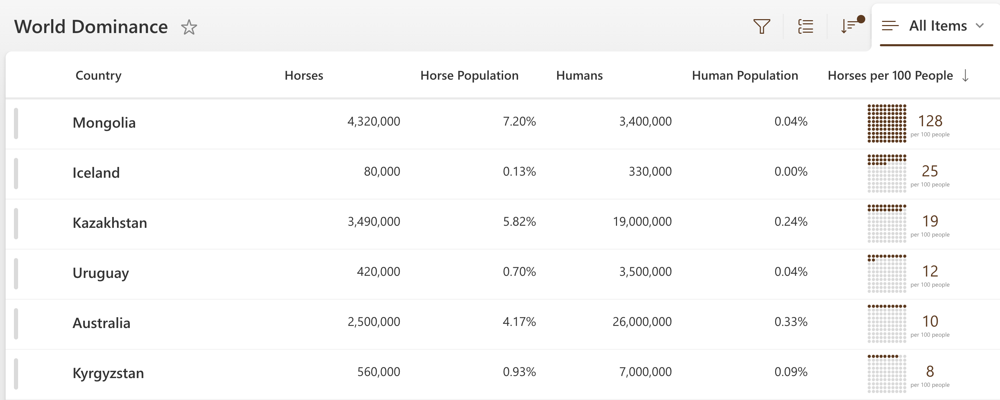
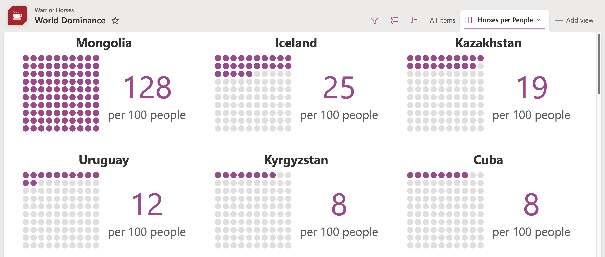
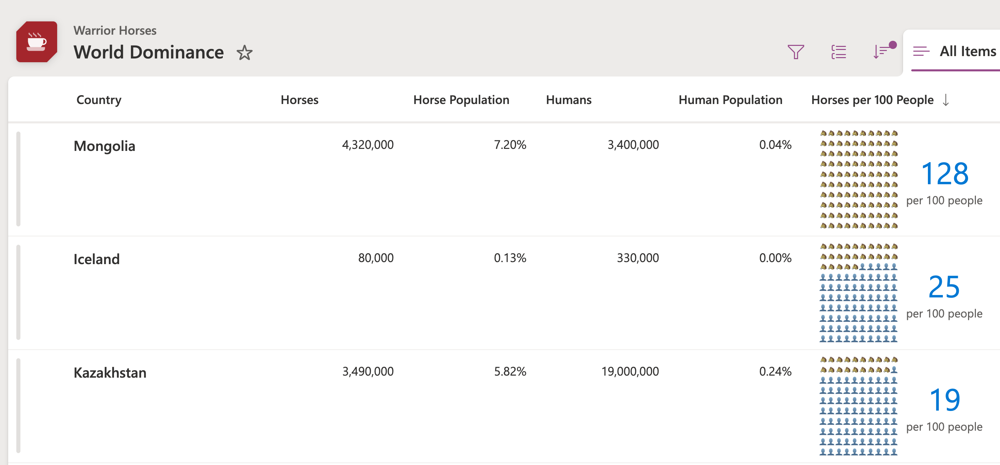

# Per 100 People Grid

## Podsumowanie
Ta próbka pokazuje displaying a grid of 100 dots where dots are colored based on how many of something per 100 people. Format shows of nested `forEach` elements using `loopIndex` to reference position and `em` size units to show relative scaling based on the root `font-size`. Wowee!

### number-per-100-people-grid.json
This is the primary sample. It uses the `@currentField` value, but you could switch this out to reference a different column if you'd like. Możesz również adjust the sizing by adjusting the `fontSize` of the root element.

### number-per-100-people-gallery.json
This is a gallery view format that utilizes `columnFormatterReference` to pull in the `number-per-100-people-grid.json` format. It assumes the column name is `HorsesPerPeople` so just swap that out for your column where the format is applied. You can have the scaling be inherited from the gallery settings by removing the `font-size` from the root element (the column will inherit from the list and the gallery will inherit from it's root element).

### number-per-100-people-grid-emoji.json
This is an example of taking the same technique but using emojis instead.

## Wymagania widoku

Ten format można zastosować do any number column. It expects the value to be a value from 0 to 100 (values above or below this number won't be accurately reflected). This could be a percent value if you'd like, you'll just need to update the formula to multiply it by 100.

## Przykład

Rozwiązanie|Autor(zy)
--------|---------
number-per-100-people-grid.json | [Chris Kent](https://github.com/thechriskent)
number-per-100-people-gallery.json | [Chris Kent](https://github.com/thechriskent)
number-per-100-people-grid-emoji.json | [Chris Kent](https://github.com/thechriskent)

## Historia wersji

Wersja|Data|Uwagi
-------|----|--------
1.0|25 września 2025|Wersja początkowa

## Zastrzeżenie
**TEN KOD JEST DOSTARCZANY W STANIE *TAKIM, W JAKIM JEST*, BEZ JAKIEJKOLWIEK GWARANCJI, WYRAŹNEJ ANI DOROZUMIANEJ, W TYM TAKŻE DOROZUMIANYCH GWARANCJI PRZYDATNOŚCI DO OKREŚLONEGO CELU, WARTOŚCI HANDLOWEJ ANI NIENARUSZANIA PRAW.**

---

## Dodatkowe uwagi

- [Użyj formatowania kolumn do dostosowania SharePoint](https://docs.microsoft.com/en-us/sharepoint/dev/declarative-customization/column-formatting)

