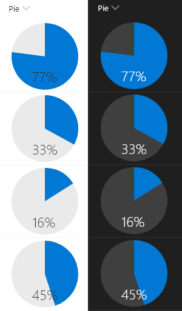

# Pie Chart

## Podsumowanie
This example renders whole pie in neutralLight with radius 50 and the number% (column value) as a slice of the pie in blue using `<svg>` with `<path>` tags. The number% displayed at the bottom of the pie in neutralPrimary.

The background and text colors are set using theme values by applying classes from the [Office UI Fabric](https://developer.microsoft.com/en-us/fabric#/styles/colors). Unfortunately, there is not a theme class for `fill` and so the pie is set to a specific value that will not update through theme switches and so should be chosen carefully. Both a light and dark theme are shown in the screenshot below.

## Wymagania widoku
- Ten format można zastosować do a Liczba column

## Przykład

Rozwiązanie|Autor(zy)
--------|---------
number-piechart.json | [Aaron Miao](https://github.com/aaronmi), [Chris Kent](https://github.com/thechriskent)

## Historia wersji

Wersja|Data|Uwagi
-------|----|--------
1.0|Dec 13, 2017|Wersja początkowa
1.1|20 marca 2018|Dodano min & max values and fixed skewed drawing issue
1.2|20 sierpnia 2018|Przełączono na wyrażenie w stylu Excelas and use of theme classes

## Zastrzeżenie
**TEN KOD JEST DOSTARCZANY W STANIE *TAKIM, W JAKIM JEST*, BEZ JAKIEJKOLWIEK GWARANCJI, WYRAŹNEJ ANI DOROZUMIANEJ, W TYM TAKŻE DOROZUMIANYCH GWARANCJI PRZYDATNOŚCI DO OKREŚLONEGO CELU, WARTOŚCI HANDLOWEJ ANI NIENARUSZANIA PRAW.**

---

## Dodatkowe uwagi

Podobny kreator znajduje się także w webparcie [Column Formatter](https://github.com/SharePoint/sp-dev-solutions/blob/master/solutions/ColumnFormatter/README.md), który pozwala na pełne dostosowanie.

> Dodatkowa wersja wykorzystująca Abstract Tree Syntax (AST) jest również dostępna dla środowisk, w których wyrażenia w stylu Excela nie są obsługiwane.

