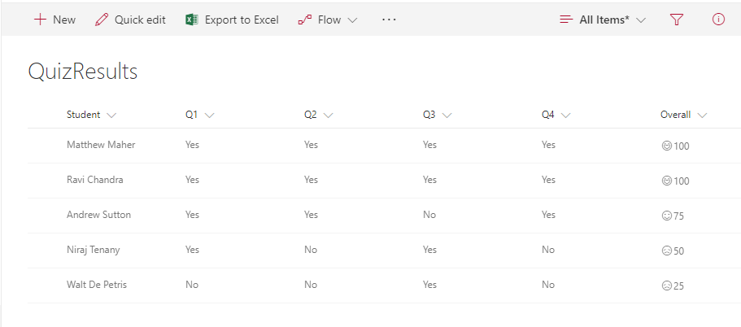

# Quiz Results with Emoji

## Podsumowanie
This allows teachers to show smiley faces next to quiz results similar to how they do it on paper. The number (based on a 0-100 score) will indicate if its a smiley or frown, which come from the Offie UI Fabric Icon set. If the number is above 90 the student gets a super smiley (`Emoji`), above 75 regular smile (`Emoji2`), above 60 neutral smiley (`EmojiNeutral`), below 60 a frown (`EmojiDisappointed`), and anything else gets an `Unknown`.

## Wymagania widoku
- Ten format można zastosować do a Liczba column

## Przykład

Rozwiązanie|Autor(zy)
--------|---------
number-quiz-smiley-face.json | [Matt Maher](https://github.com/Maher256)

## Historia wersji

Wersja|Data|Uwagi
-------|----|--------
1.0|1 grudnia 2017|Wersja początkowa
1.1|18 sierpnia 2018|Switched to Excel-style expression

## Zastrzeżenie
**TEN KOD JEST DOSTARCZANY W STANIE *TAKIM, W JAKIM JEST*, BEZ JAKIEJKOLWIEK GWARANCJI, WYRAŹNEJ ANI DOROZUMIANEJ, W TYM TAKŻE DOROZUMIANYCH GWARANCJI PRZYDATNOŚCI DO OKREŚLONEGO CELU, WARTOŚCI HANDLOWEJ ANI NIENARUSZANIA PRAW.**

---

## Dodatkowe uwagi
Ta próbka wykorzystuje icons from the Office UI Fabric

- [Office UI Fabric](https://developer.microsoft.com/en-us/fabric)

> Dodatkowa wersja wykorzystująca Abstract Tree Syntax (AST) jest również dostępna dla środowisk, w których wyrażenia w stylu Excela nie są obsługiwane.

