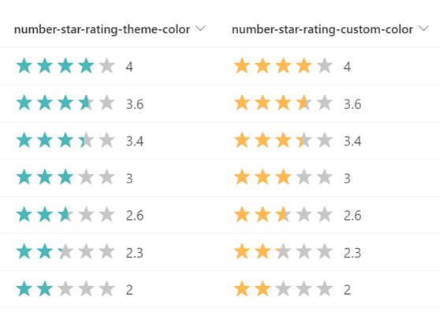
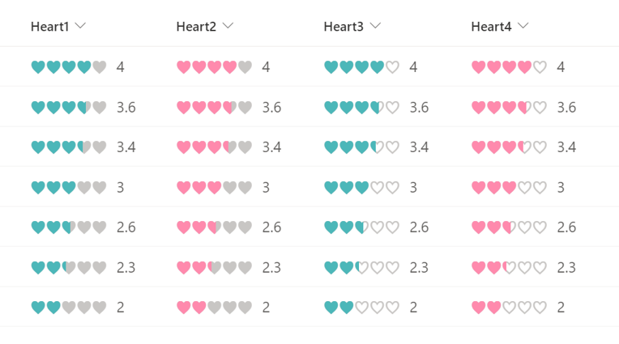

# Star Rating

## Podsumowanie
Ta próbka pokazuje changing the value of a number column to a star rating.

- `number-star-rating.json` uses the theme color of the site as the color of the star.
- `number-star-rating-custom-color.json` uses the HTML color code as the the color of the star, and in the sample, `#FFB951` is set.

Możesz również change the `★` set in `txtContent` to `♥` or `♡` to make it a heart rating.

## Wymagania widoku
Ten format można zastosować do a Liczba column (the format expects values from 0-5)

## Przykład

Rozwiązanie|Autor(zy)
--------|---------
number-star-rating.json | [Tetsuya Kawahara](https://github.com/tecchan1107)
number-star-rating-custom-color.json | [Tetsuya Kawahara](https://github.com/tecchan1107)

## Historia wersji

Wersja |Data          |Uwagi
--------|--------------|--------
1.0     |czerwca 11, 2022 |Wersja początkowa

## Zastrzeżenie
**TEN KOD JEST DOSTARCZANY W STANIE *TAKIM, W JAKIM JEST*, BEZ JAKIEJKOLWIEK GWARANCJI, WYRAŹNEJ ANI DOROZUMIANEJ, W TYM TAKŻE DOROZUMIANYCH GWARANCJI PRZYDATNOŚCI DO OKREŚLONEGO CELU, WARTOŚCI HANDLOWEJ ANI NIENARUSZANIA PRAW.**

