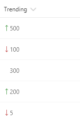
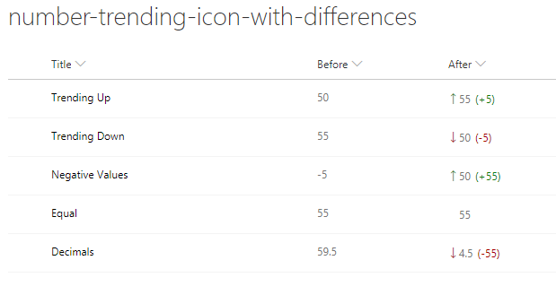

# Show trending up/trending down icons 

## Podsumowanie
These formats rely on two number fields, `Before` and `After`, for which the values can be compared. They show the appropriate trending icon next to the value of the `After` field, depending on that field's value compared to the value in `Before`. The `sp-field-trending--up` class is used when `After`'s value is higher; the `sp-field-trending--down` class is used when `After`'s value is lower. No icon is shown when they are equal (padding is added to keep consistent alignment).

### Trending Icons (number-trending-icon.json)

|Condition|Class|Icon|Style|
|---|---|---|---|
|After **>** Before|sp-field-trending--up|SortUp|padding-left:0|
|After **<** Before|sp-field-trending--down|SortDown|padding-left:0|
|After **=** Before|||padding-left:12px|

### Trending Icons with Value Difference (number-trending-icon-with-difference.json)

Ten format wyświetla również różnicę wartości między polami `Before` i `After`. Jeśli wartość `After` jest większa niż `Before`, różnica liczbowa zostanie pokazana jako `(+XX)`. Jeśli wartość `After` jest mniejsza niż `Before`, różnica liczbowa zostanie pokazana jako `(-XX)`.

The difference values are in a ``, separate from the `After` ``, allowing for unique properties to be applied without altering the `After` value.

#### Difference Calculation
|Condition|Expression|Class|
|---|---|---|
|After **>** Before|After - Before|sp-field-trending--up|
|After **<** Before|Before - After|sp-field-trending--down|
|After **=** Before|No Expression Performed||

## Wymagania widoku
- Ten format można zastosować do any column
- This format expects a Number column with an internal name of `After`
- This format expects a Number column with an internal name of `Before`

## Przykład

Rozwiązanie|Autor(zy)
--------|---------
number-trending-icon.json | [SharePoint Team](https://github.com/SharePoint)
number-trending-icon-with-difference.json | [David Warner II](https://github.com/PopWarner)

## Historia wersji

Wersja|Data|Uwagi
-------|----|--------
1.0|November 2, 2017|Wersja początkowa
1.1|March 20, 2018|Dodano equal value styling
1.2|June 12, 2018|With Difference format added
1.3|August 20, 2018|Updated to use Excel-style expressions

## Zastrzeżenie
**TEN KOD JEST DOSTARCZANY W STANIE *TAKIM, W JAKIM JEST*, BEZ JAKIEJKOLWIEK GWARANCJI, WYRAŹNEJ ANI DOROZUMIANEJ, W TYM TAKŻE DOROZUMIANYCH GWARANCJI PRZYDATNOŚCI DO OKREŚLONEGO CELU, WARTOŚCI HANDLOWEJ ANI NIENARUSZANIA PRAW.**

---

## Dodatkowe uwagi
Ta próbka jest również opisana w głównej dokumentacji dotyczącej formatowania kolumn.

A similar template is also included in the [Column Formatter](https://github.com/SharePoint/sp-dev-solutions/blob/master/solutions/ColumnFormatter/README.md) webpart.

- [Użyj formatowania kolumn do dostosowania SharePoint](https://docs.microsoft.com/en-us/sharepoint/dev/declarative-customization/column-formatting)

> Additional versions using Abstract Tree Syntax (AST) are also provided for environments where the Excel-style expressions are not supported.

