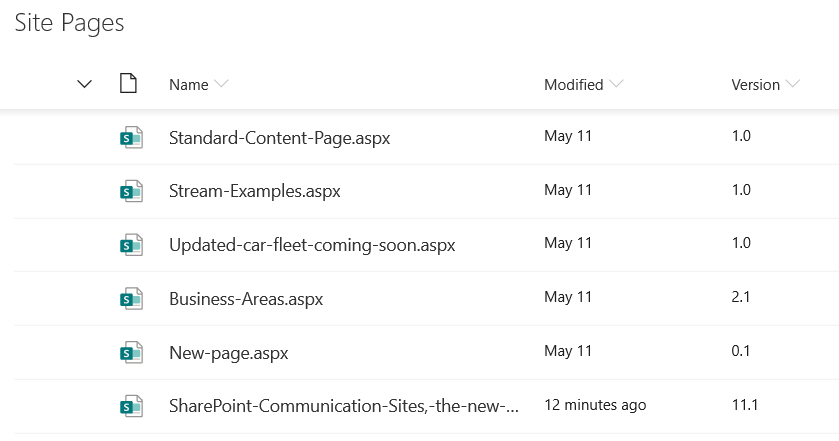
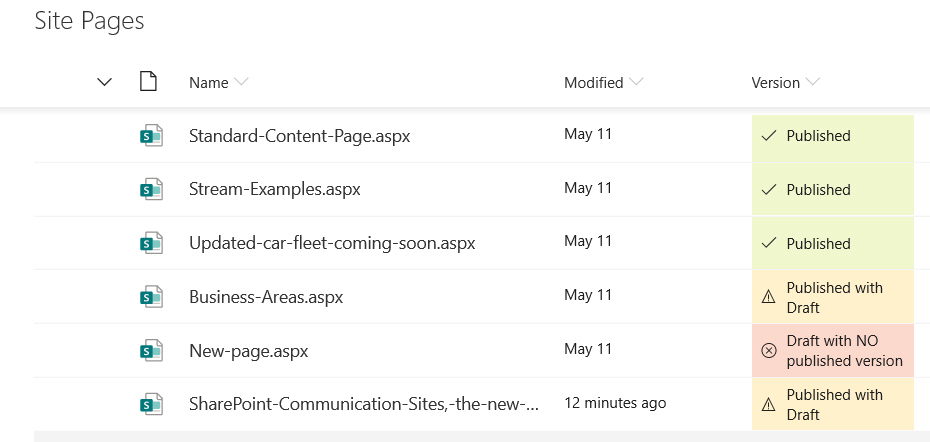

# Publishing Status

## Podsumowanie
Sample contains an example of using the modulo math expression for highlighting 'published', 'published with draft' and 'draft with no published versions' of pages

**Before**

**After**

## Wymagania widoku

- Add the version column to the view, this must be done via the "Edit current view" or classic view editing page to see the version column option.

## Przykład

Rozwiązanie|Autor(zy)
--------|---------
number-version-publish-status.json | [Paul Bullock](https://github.com/pkbullock)

## Historia wersji

Wersja|Data|Uwagi
-------|----|--------
1.0| maja 20, 2019|Wersja początkowa
1.1| czerwca 15, 2022|Version number added

## Zastrzeżenie
**TEN KOD JEST DOSTARCZANY W STANIE *TAKIM, W JAKIM JEST*, BEZ JAKIEJKOLWIEK GWARANCJI, WYRAŹNEJ ANI DOROZUMIANEJ, W TYM TAKŻE DOROZUMIANYCH GWARANCJI PRZYDATNOŚCI DO OKREŚLONEGO CELU, WARTOŚCI HANDLOWEJ ANI NIENARUSZANIA PRAW.**

---

## Dodatkowe uwagi

