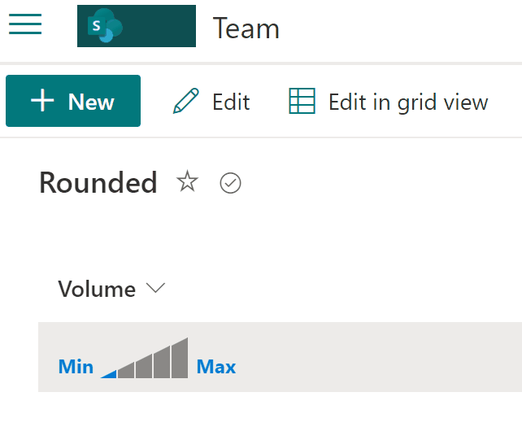

# Volume Option

## Podsumowanie
Ta próbka zawiera visual selection of volume from 0 to 5.

## Wymagania widoku
- Format oczekuje następujących pól:

Pole |Typ
--------|---------
Volume | Liczba - Volume options from 0 to 5 

## Przykład

Rozwiązanie|Autor(zy)
--------|---------
number-volume.json | [André Lage](https://github.com/aaclage)

## Historia wersji

Wersja|Data|Uwagi
-------|----|--------
1.0|01 kwietnia 2022|Wersja początkowa

## Zastrzeżenie
**TEN KOD JEST DOSTARCZANY W STANIE *TAKIM, W JAKIM JEST*, BEZ JAKIEJKOLWIEK GWARANCJI, WYRAŹNEJ ANI DOROZUMIANEJ, W TYM TAKŻE DOROZUMIANYCH GWARANCJI PRZYDATNOŚCI DO OKREŚLONEGO CELU, WARTOŚCI HANDLOWEJ ANI NIENARUSZANIA PRAW.**

