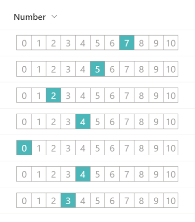

# 0 to 10 Rating Scale

## Podsumowanie

Ta próbka pokazuje the use of the `split` operator to change the value of a number column to the appearance of a 0 to 10 rating scale.

## Wymagania widoku
Ten format można zastosować do a Number column (the format expects values from 0-10)

## Przykład

Rozwiązanie|Autor(zy)
--------|---------
number-zero-to-ten-rating.json | [Tetsuya Kawahara](https://github.com/tecchan1107)

## Historia wersji

Wersja |Data               |Uwagi
--------|-------------------|--------
1.0     |September 18, 2022 |Wersja początkowa

## Zastrzeżenie
**TEN KOD JEST DOSTARCZANY W STANIE *TAKIM, W JAKIM JEST*, BEZ JAKIEJKOLWIEK GWARANCJI, WYRAŹNEJ ANI DOROZUMIANEJ, W TYM TAKŻE DOROZUMIANYCH GWARANCJI PRZYDATNOŚCI DO OKREŚLONEGO CELU, WARTOŚCI HANDLOWEJ ANI NIENARUSZANIA PRAW.**

