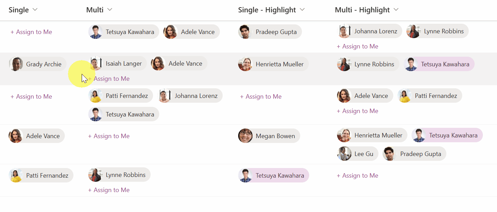
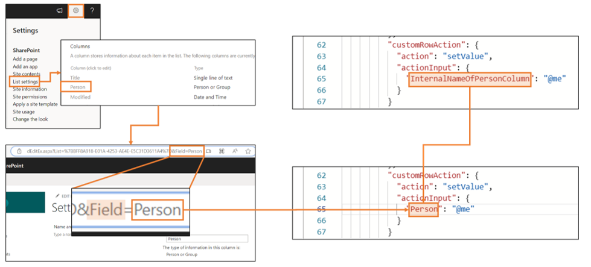

# Assign to Me

## Podsumowanie

Ta próbka pokazuje the use of the `setValue` action of `customRowAction` to set the current logged-in user in the Person column.

When using `person-assign-to-me-highlight-single.json` and `person-assign-to-me-highlight-multi.json`, the current user has different background and text colors than the other users to stand out . This is implemented using `@me`. The background and text colors use the `ms-bgColor-themeLighter` and `ms-fontColor-themeDarker` classes, which change to match the site's theme color.

> [!NOTE]  
> If you use this sample, you need to set the `actionInput` to the internal name of the Person column to be updated.  
> 

## Wymagania widoku
- Ten format można zastosować do a Person column.

## Przykład

Rozwiązanie|Autor(zy)
--------|---------
person-assign-to-me.json | [Tetsuya Kawahara](https://github.com/tecchan1107)
person-assign-to-me-multi.json | [Tetsuya Kawahara](https://github.com/tecchan1107)
person-assign-to-me-highlight-single.json | [Tetsuya Kawahara](https://github.com/tecchan1107)
person-assign-to-me-highlight-multi.json | [Tetsuya Kawahara](https://github.com/tecchan1107)

## Historia wersji

Wersja |Data         |Uwagi
--------|-------------|--------
1.0     |May 11, 2023 |Wersja początkowa
1.1     |April 26, 2024 |Dodano `person-assign-to-me-highlight-single.json` and `person-assign-to-me-highlight-multi.json`
1.2     |April 28, 2024 |Dodano hover effect
1.3     |August 13, 2024 |Poprawiono the size of the user's image

## Zastrzeżenie
**TEN KOD JEST DOSTARCZANY W STANIE *TAKIM, W JAKIM JEST*, BEZ JAKIEJKOLWIEK GWARANCJI, WYRAŹNEJ ANI DOROZUMIANEJ, W TYM TAKŻE DOROZUMIANYCH GWARANCJI PRZYDATNOŚCI DO OKREŚLONEGO CELU, WARTOŚCI HANDLOWEJ ANI NIENARUSZANIA PRAW.**

