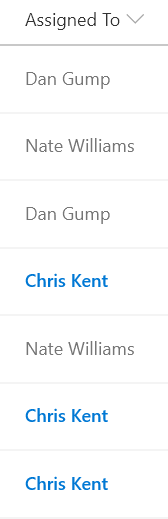

# Highlight the Current User

## Podsumowanie
Ta próbka wykorzystuje the `@me` keyword to check if the person field is the current user and shows that person using a different color and weight. This is a dynamic check that will always highlight the user using the list (not the creater of the format). This template could easily be extended to apply different/additional styles or icons as desired by simply copying the same expression logic for other fields.

The [Office UI Fabric](https://developer.microsoft.com/en-us/fabric) theme color classes and a font weight class are used to ensure the format looks good across themes (including custom themes).

## Wymagania widoku
- Ten format można zastosować do a Person column

## Przykład

Rozwiązanie|Autor(zy)
--------|---------
person-currentuser.json | [Chris Kent](https://github.com/thechriskent)

## Historia wersji

Wersja|Data|Uwagi
-------|----|--------
1.0|March 20, 2018|Wersja początkowa
1.1|August 18, 2018|Using theme classes and switched to Excel-style expressions

## Zastrzeżenie
**TEN KOD JEST DOSTARCZANY W STANIE *TAKIM, W JAKIM JEST*, BEZ JAKIEJKOLWIEK GWARANCJI, WYRAŹNEJ ANI DOROZUMIANEJ, W TYM TAKŻE DOROZUMIANYCH GWARANCJI PRZYDATNOŚCI DO OKREŚLONEGO CELU, WARTOŚCI HANDLOWEJ ANI NIENARUSZANIA PRAW.**

---

## Dodatkowe uwagi
Ta próbka jest również opisana w głównej dokumentacji dotyczącej formatowania kolumn.

A similar template is also included in the [Column Formatter](https://github.com/SharePoint/sp-dev-solutions/blob/master/solutions/ColumnFormatter/README.md) webpart.

- [Użyj formatowania kolumn do dostosowania SharePoint](https://docs.microsoft.com/en-us/sharepoint/dev/declarative-customization/column-formatting#me)

> An additional version using Abstract Tree Syntax (AST) is also provided for environments where the Excel-style expressions are not supported.

A similar sample is available for use with multi-select person fields: [multi-person-currentuser](../multi-person-currentuser)

