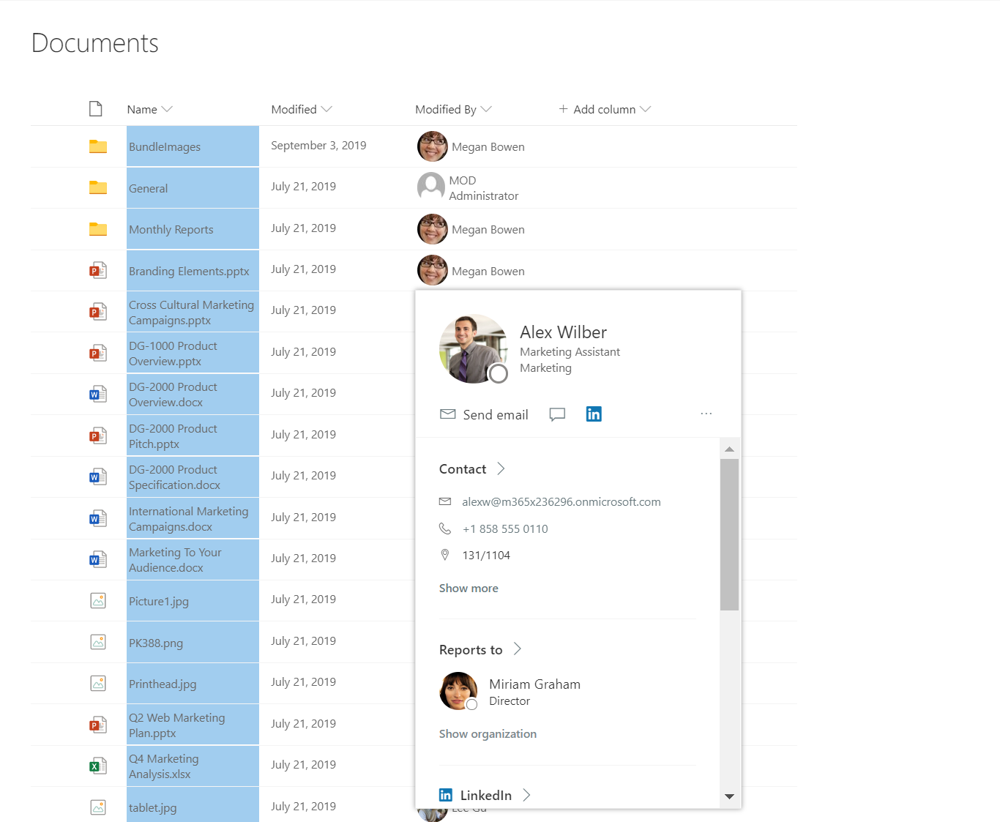

# Person Hover Card

## Podsumowanie
Demonstrates showing a default hover card for a person field.

## Wymagania widoku
- Ten format można zastosować do a Person column

## Przykład

Rozwiązanie|Autor(zy)
--------|---------
person-hover-card.json | [Niket Jain](https://github.com/NiketJain)

## Historia wersji

Wersja|Data|Uwagi
-------|----|--------
1.0|April 08, 2020|Wersja początkowa
1.1|October 02, 2023|Poprawiono to use @currentField from [$Editor] to make it available in any Person column.

## Zastrzeżenie
**TEN KOD JEST DOSTARCZANY W STANIE *TAKIM, W JAKIM JEST*, BEZ JAKIEJKOLWIEK GWARANCJI, WYRAŹNEJ ANI DOROZUMIANEJ, W TYM TAKŻE DOROZUMIANYCH GWARANCJI PRZYDATNOŚCI DO OKREŚLONEGO CELU, WARTOŚCI HANDLOWEJ ANI NIENARUSZANIA PRAW.**

---

## Dodatkowe uwagi

- None

