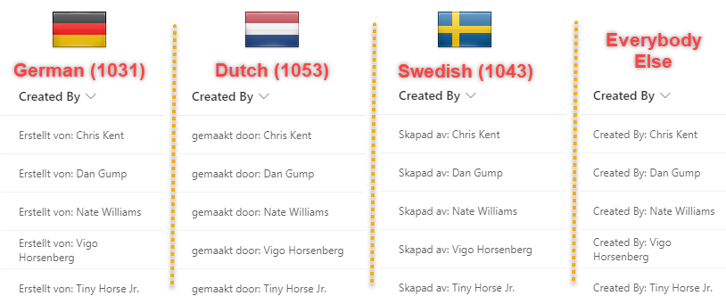

# Lokalizacja osoby

## Podsumowanie
Ta próbka pokazuje changing text output based on the `@lcid` token. This allows you to provide localized text within your format ensuring that users in various regions can use your formats without issue.

## Wymagania widoku

Ten format można zastosować do any peson column. Shown above on the default Created By column.

## Przykład

Rozwiązanie|Autor(zy)
--------|---------
person-localization.json | [Chris Kent](https://github.com/thechriskent)

## Historia wersji

Wersja|Data|Uwagi
-------|----|--------
1.0|27 kwietnia 2022|Wersja początkowa

## Zastrzeżenie
**TEN KOD JEST DOSTARCZANY W STANIE *TAKIM, W JAKIM JEST*, BEZ JAKIEJKOLWIEK GWARANCJI, WYRAŹNEJ ANI DOROZUMIANEJ, W TYM TAKŻE DOROZUMIANYCH GWARANCJI PRZYDATNOŚCI DO OKREŚLONEGO CELU, WARTOŚCI HANDLOWEJ ANI NIENARUSZANIA PRAW.**

---

## Dodatkowe uwagi

- [Użyj formatowania kolumn do dostosowania SharePoint](https://docs.microsoft.com/en-us/sharepoint/dev/declarative-customization/column-formatting)

