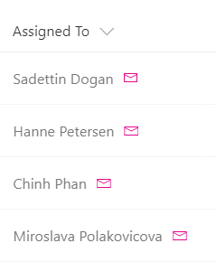

# Person Mail To Link

## Podsumowanie
Możesz użyć formatowania kolumn, aby render quick action links next to fields. This sample, intended for a person field, renders two elements inside the parent `
` element:

- A `` element that contains the person’s display name.
- An `<a />` element that opens a mailto: link that creates an email with a subject and body populated dynamically via item metadata. The `<a />` element is styled using the `sp-field-quickActions` class and uses the `iconName` attribute to make it a clickable email icon. 

## Wymagania widoku
- Ten format powinien być zastosowany do a Person column

## Przykład

Rozwiązanie|Autor(zy)
--------|---------
person-mailto.json | [SharePoint Team](https://github.com/SharePoint)

## Historia wersji

Wersja|Data|Uwagi
-------|----|--------
1.0|November 2, 2017|Wersja początkowa
1.1|August 18, 2018|Changed from generic-action-button to person-mailto and switched to Excel-style expressions

## Zastrzeżenie
**TEN KOD JEST DOSTARCZANY W STANIE *TAKIM, W JAKIM JEST*, BEZ JAKIEJKOLWIEK GWARANCJI, WYRAŹNEJ ANI DOROZUMIANEJ, W TYM TAKŻE DOROZUMIANYCH GWARANCJI PRZYDATNOŚCI DO OKREŚLONEGO CELU, WARTOŚCI HANDLOWEJ ANI NIENARUSZANIA PRAW.**

---

## Dodatkowe uwagi
Ta próbka jest również opisana w głównej dokumentacji dotyczącej formatowania kolumn

- [Użyj formatowania kolumn do dostosowania SharePoint](https://docs.microsoft.com/en-us/sharepoint/dev/declarative-customization/column-formatting)

A similar wizard is also included in the [Column Formatter](https://github.com/SharePoint/sp-dev-solutions/blob/master/solutions/ColumnFormatter/README.md) webpart that allows full customization.

> An additional version using Abstract Tree Syntax (AST) is also provided for environments where the Excel-style expressions are not supported.

