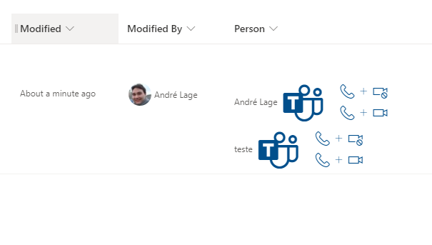

# Teams Call Format

## Podsumowanie
Ta próbka wykorzystuje [Microsoft Teams deep links](https://docs.microsoft.com/en-us/microsoftteams/platform/concepts/build-and-test/deep-links#deep-linking-to-an-audio-or-audio-video-call)  to create links from selected user that allow to make Microsoft Teams calls to user.

## Wymagania widoku
- Format oczekuje następujących pól:

Pole |Typ
--------|---------
Person | Person - Person field with multiple selections

## Przykład

Rozwiązanie|Autor(zy)
--------|---------
person-teams-call-format.json | [André Lage](https://github.com/aaclage)

## Historia wersji

Wersja|Data|Uwagi
-------|----|--------
1.0|16 grudnia 2021|Wersja początkowa

## Zastrzeżenie
**TEN KOD JEST DOSTARCZANY W STANIE *TAKIM, W JAKIM JEST*, BEZ JAKIEJKOLWIEK GWARANCJI, WYRAŹNEJ ANI DOROZUMIANEJ, W TYM TAKŻE DOROZUMIANYCH GWARANCJI PRZYDATNOŚCI DO OKREŚLONEGO CELU, WARTOŚCI HANDLOWEJ ANI NIENARUSZANIA PRAW.**

