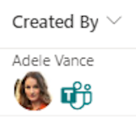
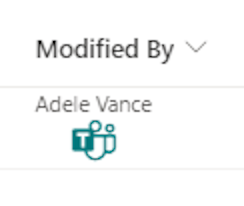
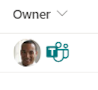

# Teams Message Format

## Podsumowanie
Ta próbka używa [deep linków Microsoft Teams](https://learn.microsoft.com/microsoftteams/platform/concepts/build-and-test/deep-link-teams#configure-deep-link-to-start-a-chat-manually), aby utworzyć link pozwalający wysłać wiadomość Microsoft Teams do użytkownika wskazanego w kolumnie.

- person-teams-message-format-name-picture.json

    

- person-teams-message-format-name.json

    

- person-teams-message-format-picture.json

    

## Wymagania widoku
- Ten format powinien być zastosowany do a Person column

## Przykład

Rozwiązanie|Autor(zy)
--------|---------
person-teams-message-format.json | [Steve Corey](https://github.com/stevecorey365)
person-teams-message-format-name.json | [Steve Corey](https://github.com/stevecorey365)
person-teams-message-format-picture.json | [Steve Corey](https://github.com/stevecorey365)

## Historia wersji

Wersja|Data|Uwagi
-------|----|--------
1.0|September 20, 2023|Wersja początkowa

## Zastrzeżenie
**TEN KOD JEST DOSTARCZANY W STANIE *TAKIM, W JAKIM JEST*, BEZ JAKIEJKOLWIEK GWARANCJI, WYRAŹNEJ ANI DOROZUMIANEJ, W TYM TAKŻE DOROZUMIANYCH GWARANCJI PRZYDATNOŚCI DO OKREŚLONEGO CELU, WARTOŚCI HANDLOWEJ ANI NIENARUSZANIA PRAW.**

