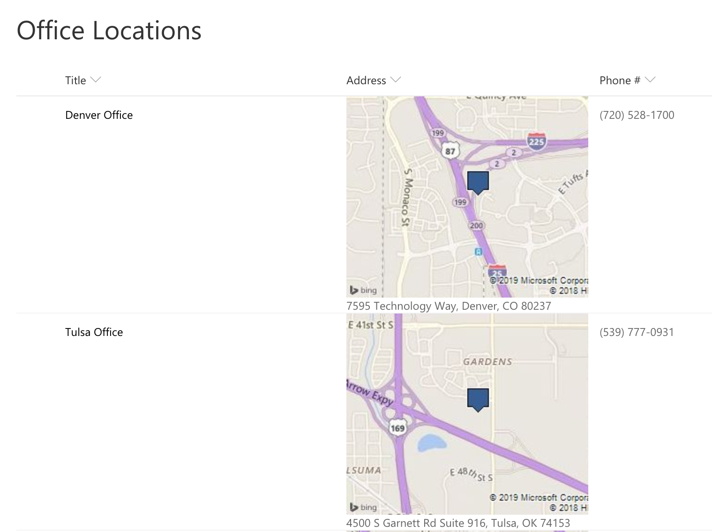

# Display a Bing Maps Image for a Location

## Podsumowanie
This template uses Bing Maps' [staticmap API](https://docs.microsoft.com/en-us/bingmaps) which generates an image using a parameterized URL. The template only uses the most basic features of map location and image size. To see all of the available option see the static map documentation: ([static map](https://docs.microsoft.com/en-us/bingmaps/rest-services/imagery/get-a-static-map)

In this template we are just using the current field's value as the location, but you could easily make very advanced maps by combining multiple column values across your list item.

To add additional parameters, just continue to add operands in the + operation!

### API key

The text "insert your Bing Map API Key Here" in the template (the text after `&key`) should be changed to your own FREE API Key. Getting a key takes 2 minutes and is FREE: [Get API Key](https://docs.microsoft.com/en-us/bingmaps/getting-started/bing-maps-dev-center-help/getting-a-bing-maps-key)

### Typy kolumn

The values are expected to be addresses such as _Tulsa, OK_ or _Texas_ or _200 S Main St. Broken Arrow, OK 74012_.

Ten format będzie działać z Choice, Pojedyncza linia tekstu and Wiele linii tekstu columns without any changes. To use Lookup columns, you'll need to change the 2 occurences of `[$Address]` to `[$Address.lookupValue]`.

## Apply Column Formatting to Multi-Line of Text Field
If your address is stored in a Multi-Line of Text field, there are a few extra clicks required to get to the column formatting settings.  In your list, click the Gear --> List Settings. Znajdź your column name in the list of columns and select it. Paste in the code in the Column Formatting Section at the bottom of the page.

## Wymagania widoku
- Ten format można zastosować do a text/choice field where the value is expected to be a location

## Przykład

Rozwiązanie|Autor(zy)
--------|---------
text-bing-map.json | [kwietnia Dunnam](https://github.com/aprildunnam)

## Historia wersji

Wersja|Data|Uwagi
-------|----|--------
1.0|Feb 4, 2019|Wersja początkowa

## Zastrzeżenie
**TEN KOD JEST DOSTARCZANY W STANIE *TAKIM, W JAKIM JEST*, BEZ JAKIEJKOLWIEK GWARANCJI, WYRAŹNEJ ANI DOROZUMIANEJ, W TYM TAKŻE DOROZUMIANYCH GWARANCJI PRZYDATNOŚCI DO OKREŚLONEGO CELU, WARTOŚCI HANDLOWEJ ANI NIENARUSZANIA PRAW.**

---

