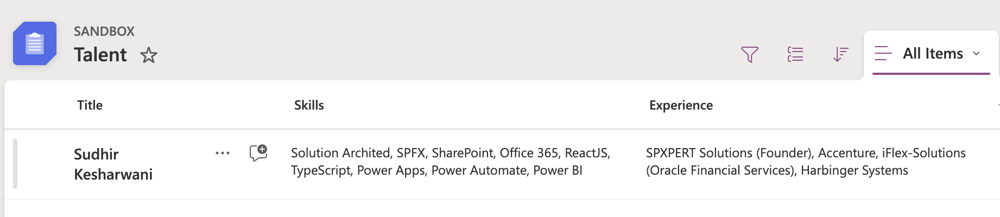
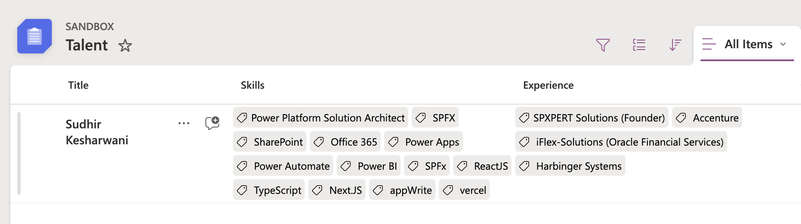

# Display Comma-Separated Text as Tags

## Podsumowanie

Ta próbka pokazuje using the `split` function (O365 only) to display a comma separated text as tags. Próbka also uses the `forEach` attribute to demostrate the forEach loop capability. In this sample, the comma separated text values are displayed as a tags for the record. JAZZ up your SharePoint list display with this awesome column formatting.

- Plain SharePoint list with comma separated text.
  

- Your new SharePoint list with values displayed as tags.
  

## Wymagania widoku

- Ten format można zastosować do a Pojedyncza linia tekstu or Multiline of Text column
- Ten format używa operatorów dostępnych wyłącznie w SharePoint Online i nie może być używany w SharePoint 2019

## Przykład

Rozwiązanie|Autor(zy)
--------|---------
text-comma-separated-value-tags.json | [Sudhir Kesharwani](https://github.com/sudhirke)

## Historia wersji

| Version | Data               | Uwagi        |
| ------- | ------------------ | --------------- |
| 1.0     | września 04, 2025 | Wersja początkowa |

## Zastrzeżenie

**THIS CODE IS PROVIDED _AS IS_ WITHOUT WARRANTY OF ANY KIND, EITHER EXPRESS OR IMPLIED, INCLUDING ANY IMPLIED WARRANTIES OF FITNESS FOR A PARTICULAR PURPOSE, MERCHANTABILITY, OR NON-INFRINGEMENT.**

---

## Dodatkowe uwagi

- [Użyj formatowania kolumn do dostosowania SharePoint](https://docs.microsoft.com/sharepoint/dev/declarative-customization/column-formatting)

- This sample was built and tested on SharePoint Online. This may not work on the ON-PREM SharePoint editions.

