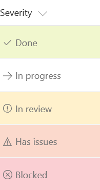

# Warunkowe formatowanie tekstu (ważność)

## Podsumowanie
Możesz zastosować formatowanie warunkowe do text or choice fields that might contain a fixed set of values. Poniższe example applies different classes depending on whether the value of the field is Done, In Review, Blocked, or another value. This example applies a CSS class (`sp-field-severity--low, sp-field-severity--good, sp-field-severity--warning, sp-field-severity--blocked`) to the  `
` based on the field's value. This is what determines the element's background color. A class of `ms-fontColor-neutralSecondary` is always applied to ensure the text color is legible in both light and dark themes. Then, it outputs a `` element with an `iconName` attribute. This attribute applies another CSS class to that `` that shows an [Office UI Fabric](https://dev.office.com/fabric#/) icon inside that element. Finally, another `` element is outputted that contains the value inside the field.

This pattern is useful when you want different values to map to different levels of urgency or severity. You can start from this example and edit it to specify your own field values and the styles and icons that should map to those values.

## Wymagania widoku
- Ten format można zastosować do a text/choice column and expects the values Done, In progress, In review, Has Issues, or anything else

## Przykład

Rozwiązanie|Autor(zy)
--------|---------
text-conditional-format.json | [Lincoln DeMaris](https://github.com/ldemaris)

## Historia wersji

Wersja|Data|Uwagi
-------|----|--------
1.0|2 listopada 2017|Wersja początkowa
1.1|20 sierpnia 2018|Switched to Excel-style expression, added theme fontColor, fixed issue with "Has Issues" status

## Zastrzeżenie
**TEN KOD JEST DOSTARCZANY W STANIE *TAKIM, W JAKIM JEST*, BEZ JAKIEJKOLWIEK GWARANCJI, WYRAŹNEJ ANI DOROZUMIANEJ, W TYM TAKŻE DOROZUMIANYCH GWARANCJI PRZYDATNOŚCI DO OKREŚLONEGO CELU, WARTOŚCI HANDLOWEJ ANI NIENARUSZANIA PRAW.**

---

## Dodatkowe uwagi
Ta próbka jest również opisana w głównej dokumentacji dotyczącej formatowania kolumn

- [Użyj formatowania kolumn do dostosowania SharePoint](https://docs.microsoft.com/en-us/sharepoint/dev/declarative-customization/column-formatting)

> Dodatkowa wersja wykorzystująca Abstract Tree Syntax (AST) jest również dostępna dla środowisk, w których wyrażenia w stylu Excela nie są obsługiwane.

