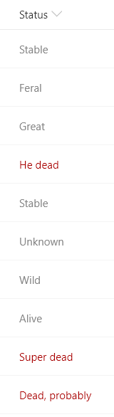

# Text Contains

## Podsumowanie
Ta próbka pokazuje using the `indexOf` function (O365 only) to test if text contains a given value. Próbka also uses the `toLowerCase` function to ensure the contains condition is case-insensitive. In this sample, if the text of the current field contains the word _"dead"_ a class is applied to turn the text red.

The `indexOf` function returns the index where a given value is found within a string (indexes start at 0). If the value is not found in the text, the result is -1.

To evaluate if text contains a given value, we want to know if the index of the value within the string is anything but -1. So we can use the function like this:

`"=if(indexOf(@currentField,'dog') != -1, 'Yes', 'No')"`

Some example values and the result using the function above:
`@currentField`|result
---|---
A dog | Yes
a Dog | No
dog's are nice | Yes
bark dog bark | Yes

Notice that the `indexOf` function is **case-sensitive**. You can do a case-insensitive check by adding the `toLowerCase` function like this:

`"=if(indexOf(toLowerCase(@currentField),'dog') != -1, 'Yes', 'No')"`

## Wymagania widoku
- Ten format można zastosować do a Text or Choice column
- This format uses operators only available in SharePoint Online and cannot be used in SharePoint 2019

## Przykład

Rozwiązanie|Autor(zy)
--------|---------
text-contains.json | [Chris Kent](https://github.com/thechriskent)

## Historia wersji

Wersja|Data|Uwagi
-------|----|--------
1.0|February 5, 2019|Wersja początkowa

## Zastrzeżenie
**TEN KOD JEST DOSTARCZANY W STANIE *TAKIM, W JAKIM JEST*, BEZ JAKIEJKOLWIEK GWARANCJI, WYRAŹNEJ ANI DOROZUMIANEJ, W TYM TAKŻE DOROZUMIANYCH GWARANCJI PRZYDATNOŚCI DO OKREŚLONEGO CELU, WARTOŚCI HANDLOWEJ ANI NIENARUSZANIA PRAW.**

---

## Dodatkowe uwagi
- [Użyj formatowania kolumn do dostosowania SharePoint](https://docs.microsoft.com/en-us/sharepoint/dev/declarative-customization/column-formatting)

The `indexOf` and `toLowerCase` functions are not available in SharePoint 2019

