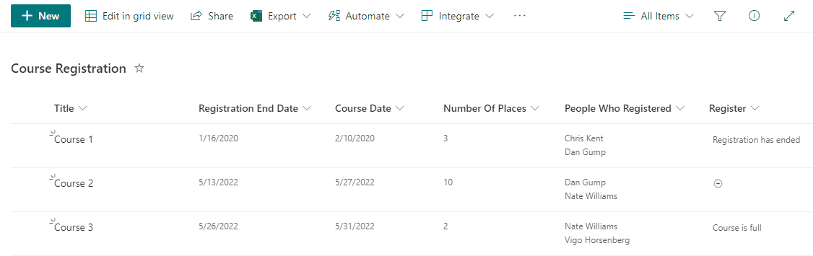

# Course Registration

## Podsumowanie
Demonstrates creating a button to register for a course. It checks if the course is already full or if the user has already registered for the course and prevents registration when either is true.

## Wymagania widoku

|Type|Internal Name|Additional Information
|---|:---:|---|
|DateTime|RegistrationEndDate| Column for when the registration period for the course ends
|DateTime|CourseDate|Column for when the Course is scheduled
|Text|Register|Column to show the registration button, apply the template to this column
|Number|NumberOfPlaces|Column for the number of available places in the course
|Multi-Person|PeopleWhoRegistered|Column to track the number of people who already registered

## Przykład

Rozwiązanie|Autor(zy)
--------|---------
text-course-registration.json | [Dennis](https://github.com/expiscornovus), [Chris Kent](https://github.com/thechriskent)

## Historia wersji

Wersja |Data          |Uwagi
--------|--------------|--------------------------------
1.0     |November 25, 2021 |Wersja początkowa
2.0     |May 10, 2022 | Dodano unregister functionality

## Zastrzeżenie
**TEN KOD JEST DOSTARCZANY W STANIE *TAKIM, W JAKIM JEST*, BEZ JAKIEJKOLWIEK GWARANCJI, WYRAŹNEJ ANI DOROZUMIANEJ, W TYM TAKŻE DOROZUMIANYCH GWARANCJI PRZYDATNOŚCI DO OKREŚLONEGO CELU, WARTOŚCI HANDLOWEJ ANI NIENARUSZANIA PRAW.**
##

---

## Dodatkowe uwagi

