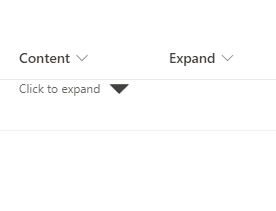

# Expand collapse format

## Podsumowanie
Poniższe sample provide a format that display content based on expand/collapse effect using support column and option `setValue`.

> Note - This relies on updating the underlying list item meaning that the expanded/collapse state applies to ALL users viewing the item

## Wymagania widoku
- Ten format można zastosować do any column type though the example is based on a single line of text field.

Nazwa kolumny|Typ
--------|---------
Content  | single line of text
Expand | Yes/No - default value **"No"**

## Przykład

Rozwiązanie|Autor(zy)
--------|---------
text-expand-collapse-format.json | [André Lage](https://github.com/aaclage)

## Historia wersji

Wersja|Data|Uwagi
-------|----|--------
1.0|10 stycznia 2022|Wersja początkowa

## Zastrzeżenie
**TEN KOD JEST DOSTARCZANY W STANIE *TAKIM, W JAKIM JEST*, BEZ JAKIEJKOLWIEK GWARANCJI, WYRAŹNEJ ANI DOROZUMIANEJ, W TYM TAKŻE DOROZUMIANYCH GWARANCJI PRZYDATNOŚCI DO OKREŚLONEGO CELU, WARTOŚCI HANDLOWEJ ANI NIENARUSZANIA PRAW.**

---

## Dodatkowe uwagi

