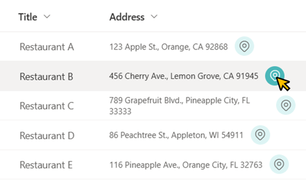

# Display Link to Google Maps

## Podsumowanie
Ta próbka pokazuje displaying a link to Google Maps. The URL for that link is set to the value `https://maps.google.com/maps?q=[Field Value]` and when the link is opened, a map around the location of the field value is displayed.

## Wymagania widoku
- Ten format można zastosować do any column type (but is intended for text fields)

## Przykład

Rozwiązanie|Autor(zy)
--------|---------
text-googlemaps-link.json | [Tetsuya Kawahara](https://github.com/tecchan1107)

## Historia wersji

Wersja |Data          |Uwagi
--------|--------------|--------
1.0     |April 6, 2023 |Wersja początkowa

## Zastrzeżenie
**TEN KOD JEST DOSTARCZANY W STANIE *TAKIM, W JAKIM JEST*, BEZ JAKIEJKOLWIEK GWARANCJI, WYRAŹNEJ ANI DOROZUMIANEJ, W TYM TAKŻE DOROZUMIANYCH GWARANCJI PRZYDATNOŚCI DO OKREŚLONEGO CELU, WARTOŚCI HANDLOWEJ ANI NIENARUSZANIA PRAW.**

