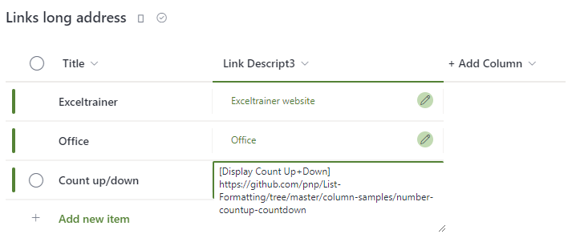

# Hyperlink long addresses

## Podsumowanie
The default hyperlink column has a limited number of characters that can be used, and this will get you into trouble when linking to, for example, OneNote pages or any other link with a lot of parameters.

Using the following code, you can easily turn a “multiple lines of text” column into a useful list with hyperlinks.

## Wymagania widoku
- Ten format można zastosować do a Multi lines of text column
- Links can to be introduced with an alternative text by preceding them with square brackets, for example, [List Formatting Samples]https://pnp.github.io/List-Formatting/

## Przykład
Rozwiązanie|Autor(zy)
--------|---------
text-hyperlink-long-addresses.json | [Geert de Kooter](https://github.com/gdk-max)

## Historia wersji
Wersja|Data|Uwagi
-------|----|--------
1.0|23 stycznia 2023|Wersja początkowa

## Zastrzeżenie

**TEN KOD JEST DOSTARCZANY W STANIE *TAKIM, W JAKIM JEST*, BEZ JAKIEJKOLWIEK GWARANCJI, WYRAŹNEJ ANI DOROZUMIANEJ, W TYM TAKŻE DOROZUMIANYCH GWARANCJI PRZYDATNOŚCI DO OKREŚLONEGO CELU, WARTOŚCI HANDLOWEJ ANI NIENARUSZANIA PRAW.**

---

## Dodatkowe uwagi
- Brak

