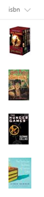

# ISBN to Book Cover Image

## Podsumowanie
This example retrieves book cover images based on their ISBN numbers by utilizing the [Open Library Covers API](https://openlibrary.org/dev/docs/api/covers). The API works by building a cover image URL with the ISBN.

Ta próbka pobiera the small (S) image, but there are also medium (M) and large (L) sizes available. Simply swap out the `S` in `-S.jpg` portion of the `src` attribute in the `img` element to retrieve one of the other sizes. 

> The values are expected to be the ISBN numbers for the books. However, this sample could easily be switched to utilize the OCLC, LCCN, OLID, or ID values for a given book.

## Wymagania widoku
- Ten format można zastosować do a text/choice column and expects the values to be ISBN numbers corresponding to books

## Przykład

Rozwiązanie|Autor(zy)
--------|---------
text-isbn-image.json | [Aaron Miao](https://github.com/aaronmi)

## Historia wersji

Wersja|Data|Uwagi
-------|----|--------
1.0|27 listopada 2017|Wersja początkowa
1.1|22 marca 2018|Dodano details about API
1.2|20 sierpnia 2018|Przełączono na wyrażenie w stylu Excela

## Zastrzeżenie
**TEN KOD JEST DOSTARCZANY W STANIE *TAKIM, W JAKIM JEST*, BEZ JAKIEJKOLWIEK GWARANCJI, WYRAŹNEJ ANI DOROZUMIANEJ, W TYM TAKŻE DOROZUMIANYCH GWARANCJI PRZYDATNOŚCI DO OKREŚLONEGO CELU, WARTOŚCI HANDLOWEJ ANI NIENARUSZANIA PRAW.**

---

## Dodatkowe uwagi
Tę próbkę można zastosować na przykład do renderowania numeru produktu jako ikony lub obrazu produktu.

> Dodatkowa wersja wykorzystująca Abstract Tree Syntax (AST) jest również dostępna dla środowisk, w których wyrażenia w stylu Excela nie są obsługiwane.

