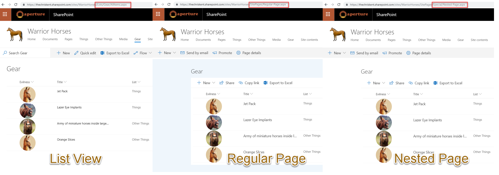

# Odwołanie do lokalnego obrazu

## Podsumowanie
Ta próbka przedstawia multiple formats to illustrate the options available to reference local image files. The primary purpose is to demonstrate the usage of `@currentWeb` (O365 only) to prevent issues with reusable formats or formats rendered outside of the main list view.

## Formaty

### text-local-image

To jest format, którego należy używać w Office 365. The image's `src` attribute is built using the `@currentWeb` token. This ensures that your format is reusable between sites and can be used within your site regardless of level (folder).

### text-hardcoded-image

Ten format pokazuje providing a full URL (including the tenant and site). This is NOT recommended because while the image will always work regardless of level, the format will have to be manually updated to be reused. For example, to use this format in your own environment you will first have to update the tenant URL.

> Dodatkowa wersja wykorzystująca Abstract Tree Syntax (AST) jest również dostępna dla środowisk, w których wyrażenia w stylu Excela nie są obsługiwane (SP2019).

### text-relative-image

Ten format pokazuje providing a relative link that assumes the format knows the position of the resources relative to where the format is rendered. This is NOT recommended because while the format is reusable across sites without manual updates required, the format is very fragile because it can easily break across your site depending on the relative location the format is rendered. For instance, a page using a list web part will be at a different level (relative foldering) than the list view itself.

> Dodatkowa wersja wykorzystująca Abstract Tree Syntax (AST) jest również dostępna dla środowisk, w których wyrażenia w stylu Excela nie są obsługiwane (SP2019).

## Wymagania widoku
- Ten format można zastosować do a Text or Choice column

## Przykład

Rozwiązanie|Autor(zy)
--------|---------
text-local-image.json | [Chris Kent](https://github.com/thechriskent)
text-hardcoded-image.json | [Chris Kent](https://github.com/thechriskent)
text-relative-image.json | [Chris Kent](https://github.com/thechriskent)

## Historia wersji

Wersja|Data|Uwagi
-------|----|--------
1.0|10 stycznia 2018|Wersja początkowa

## Zastrzeżenie
**TEN KOD JEST DOSTARCZANY W STANIE *TAKIM, W JAKIM JEST*, BEZ JAKIEJKOLWIEK GWARANCJI, WYRAŹNEJ ANI DOROZUMIANEJ, W TYM TAKŻE DOROZUMIANYCH GWARANCJI PRZYDATNOŚCI DO OKREŚLONEGO CELU, WARTOŚCI HANDLOWEJ ANI NIENARUSZANIA PRAW.**

---

## Dodatkowe uwagi
- [Użyj formatowania kolumn do dostosowania SharePoint](https://docs.microsoft.com/en-us/sharepoint/dev/declarative-customization/column-formatting)

The image's `src` attribute uses the `@currentWeb` token to ensure that regardless of where the format is rendered, the images will be pulled from the correct folder in the Documents library for the site. However, `@currentWeb` is not available in SharePoint 2019, so alternative approaches are included.

