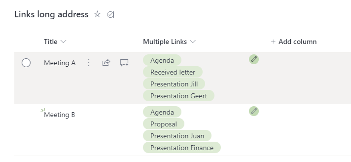

# Multiple hyperlinks in single field

## Podsumowanie
Using this sample you can have multiple hyperlinks in a single field.



## Wymagania widoku
- Ten format można zastosować do a Multi lines of text column
- The links can to be introduced with an alternative text by preceding them with square brackets, for example, [List Formatting Samples]https://pnp.github.io/List-Formatting/ seperating each link in a new row of the multi-line column using SHIFT+ENTER
- Poniższe is an example value
    ```
    [Microsoft 365 & Power Platform Community]https://pnp.github.io/
    [Sharing Is Caring]https://pnp.github.io/sharing-is-caring/
    [M365 Platform & Power Platform Community Recognition Program]https://pnp.github.io/recognitionprogram/
    ```

## Przykład

Rozwiązanie|Autor(zy)
--------|---------
text-multiple-hyperlinks.json | [Geert de Kooter](https://github.com/gdk-max)

## Historia wersji

Wersja|Data|Uwagi
-------|----|--------
1.0|26 stycznia 2023|Wersja początkowa

## Zastrzeżenie

**TEN KOD JEST DOSTARCZANY W STANIE *TAKIM, W JAKIM JEST*, BEZ JAKIEJKOLWIEK GWARANCJI, WYRAŹNEJ ANI DOROZUMIANEJ, W TYM TAKŻE DOROZUMIANYCH GWARANCJI PRZYDATNOŚCI DO OKREŚLONEGO CELU, WARTOŚCI HANDLOWEJ ANI NIENARUSZANIA PRAW.**

---

## Dodatkowe uwagi
Brak

