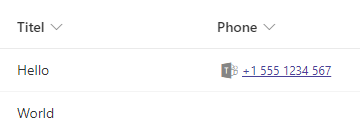

# Call phone number with Microsoft Teams

## Podsumowanie
Ta próbka pokazuje displaying a phone number stored in a single line of text column as a link to initiate a Microsoft Teams call.

## Wymagania widoku
- Ten format można zastosować do a single line of text column

## Przykład

Rozwiązanie|Autor(zy)
--------|---------
text-phonenumber-teams-call.json | [Hagen Deike](https://github.com/samurai-ka) ([@samurai@sueden.social](https://sueden.social/@samurai))

## Historia wersji

Wersja|Data|Uwagi
-------|----|--------
1.0|16 lutego 2024|Wersja początkowa

## Zastrzeżenie

**TEN KOD JEST DOSTARCZANY W STANIE *TAKIM, W JAKIM JEST*, BEZ JAKIEJKOLWIEK GWARANCJI, WYRAŹNEJ ANI DOROZUMIANEJ, W TYM TAKŻE DOROZUMIANYCH GWARANCJI PRZYDATNOŚCI DO OKREŚLONEGO CELU, WARTOŚCI HANDLOWEJ ANI NIENARUSZANIA PRAW.**

---

## Dodatkowe uwagi
- Empty fields do not show a Microsoft Teams icon.
- No syntax checking for phone numbers. What every you enter in the field will be used to initiate the Microsoft Teams call.
- Ta próbka wykorzystuje [Microsoft Teams deep link](https://learn.microsoft.com/microsoftteams/platform/concepts/build-and-test/deep-link-workflow?tabs=teamsjs-v2#configure-deep-link-manually-to-start-audio-video-call-with-users) to display a link to initiate the Microsoft Teams call.

