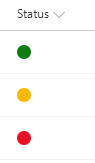

# Traffic Light (Red-Yellow-Green) Status Indicator

## Podsumowanie
Ta próbka wyświetla wskaźnik statusu w stylu sygnalizacji świetlnej (czerwony-żółty-zielony) na podstawie wartości kolumny wyboru lub tekstowej. Aby użyć kolumny lookup, zamień wszystkie wystąpienia `@currentField` na `@currentField.lookupValue`.

> The text values for the column are expected to be Red, Yellow, or Green. Any other values won't be shown.

## Wymagania widoku
- Ten format można zastosować do a text/choice column and expects the values to be Green, Yellow, Red, or anything else

## Przykład

Rozwiązanie|Autor(zy)
--------|---------
text-ryg-status-indicator.json | [Travis Lingenfelder](https://github.com/Travis-Constellation)

## Historia wersji

Wersja|Data|Uwagi
-------|----|--------
1.0|27 listopada 2017|Wersja początkowa
1.1|22 marca 2018|Uproszczono logikę
1.2|20 sierpnia 2018|Updated to use Excel-style expressions and theme classes

## Zastrzeżenie
**TEN KOD JEST DOSTARCZANY W STANIE *TAKIM, W JAKIM JEST*, BEZ JAKIEJKOLWIEK GWARANCJI, WYRAŹNEJ ANI DOROZUMIANEJ, W TYM TAKŻE DOROZUMIANYCH GWARANCJI PRZYDATNOŚCI DO OKREŚLONEGO CELU, WARTOŚCI HANDLOWEJ ANI NIENARUSZANIA PRAW.**

---

## Dodatkowe uwagi

For more information on using this custom formatting see the article [SharePoint Modern List Traffic Light (Red-Yellow-Green) Status Indicator Column](http://www.constellationsolutions.com/how-to/sharepoint-modern-list-traffic-light-red-yellow-green-status-indicator-column/)

> Dodatkowa wersja wykorzystująca Abstract Tree Syntax (AST) jest również dostępna dla środowisk, w których wyrażenia w stylu Excela nie są obsługiwane.

