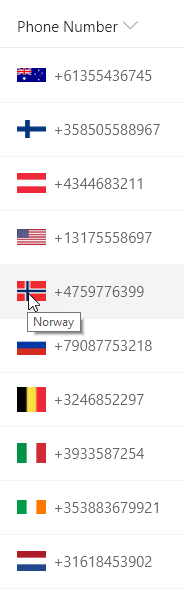
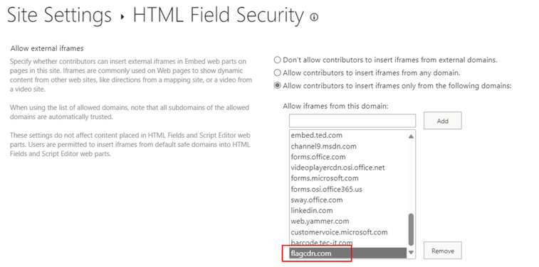

# Text StartsWith Calling Codes

## Podsumowanie
Ta próbka pokazuje using the `indexOf` function (O365 only) to test if text starts with a given value. Using the international calling code at the start of a phone number, the correct country's flag is shown next to the phone number. The same nested conditionals are also used for the tooltip.

Funkcja `indexOf` zwraca indeks, pod którym dana wartość została znaleziona w ciągu znaków (indeksy zaczynają się od 0). Jeśli wartość nie zostanie znaleziona w tekście, wynikiem jest -1.

To evaluate if text "startsWith" a given value, we want to know if the index of the value within the string is 0 (at the beginning). So we can use the function like this:

`"=if(indexOf(@currentField,'A')==0, 'Yes', 'No')"`

Kilka przykładowych wartości i wynik działania powyższej funkcji:
`@currentField`|wynik
---|---
A dog | Tak
a dog | No
Pet A dog | No

Zwróć uwagę, że funkcja `indexOf` **rozróżnia wielkość liter**. Aby wykonać sprawdzenie bez rozróżniania wielkości liter, możesz dodać funkcję `toLowerCase` w taki sposób:

`=if(indexOf(toLowerCase(@currentField),'a')==0, 'Yes', 'No')`

## Wymagania wstępne

[External image sources are blocked](https://learn.microsoft.com/sharepoint/dev/declarative-customization/formatting-syntax-reference#img-src-security) by default in the custom formatter. To allow external images, you must [add the domain to HTML Field Security](https://support.microsoft.com/office/allow-or-restrict-the-ability-to-embed-content-on-sharepoint-pages-e7baf83f-09d0-4bd1-9058-4aa483ee137b). The domain that needs to be added in this sample is `flagcdn.com`.

## Wymagania widoku
- Ten format można zastosować do a Text or Choice column
- Ten format używa operatorów dostępnych wyłącznie w SharePoint Online i nie może być używany w SharePoint 2019

## Przykład

Rozwiązanie|Autor(zy)
--------|---------
text-startswith-callingcodes.json | [Chris Kent](https://github.com/thechriskent)

## Historia wersji

Wersja|Data|Uwagi
-------|----|--------
1.0|5 lutego 2019|Wersja początkowa
1.1|29 września 2023|Dodano note about HTML Field Security and [changed domain from flags.fmcdn.net to flagcdn.com](https://flags.fmcdn.net/)

## Zastrzeżenie
**TEN KOD JEST DOSTARCZANY W STANIE *TAKIM, W JAKIM JEST*, BEZ JAKIEJKOLWIEK GWARANCJI, WYRAŹNEJ ANI DOROZUMIANEJ, W TYM TAKŻE DOROZUMIANYCH GWARANCJI PRZYDATNOŚCI DO OKREŚLONEGO CELU, WARTOŚCI HANDLOWEJ ANI NIENARUSZANIA PRAW.**

---

## Dodatkowe uwagi
- [Użyj formatowania kolumn do dostosowania SharePoint](https://docs.microsoft.com/en-us/sharepoint/dev/declarative-customization/column-formatting)

The `indexOf` function is not available in SharePoint 2019

