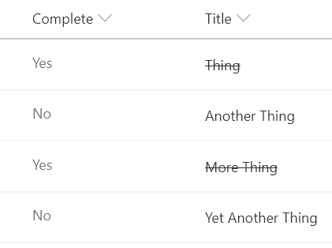

# Strikethrough on Completion

## Podsumowanie
Classic task lists add a strikethrough style to the task name when the task is marked as completed. Ta próbka pokazuje how to achieve this in a modern list view.

> If this is NOT the title field, then the `ms-fontColor-neutralPrimary` class can be removed to ensure styles match.

## Wymagania widoku
- Ten format można zastosować do any column type (but is intended for text fields)
- This format expects a Yes/No field with an internal name of `Complete`

## Przykład

Rozwiązanie|Autor(zy)
--------|---------
text-strikethrough.json | [Chris Kent](https://github.com/thechriskent)

## Historia wersji

Wersja|Data|Uwagi
-------|----|--------
1.0|August 18, 2018|Wersja początkowa

## Zastrzeżenie
**TEN KOD JEST DOSTARCZANY W STANIE *TAKIM, W JAKIM JEST*, BEZ JAKIEJKOLWIEK GWARANCJI, WYRAŹNEJ ANI DOROZUMIANEJ, W TYM TAKŻE DOROZUMIANYCH GWARANCJI PRZYDATNOŚCI DO OKREŚLONEGO CELU, WARTOŚCI HANDLOWEJ ANI NIENARUSZANIA PRAW.**

---

## Dodatkowe uwagi

> An additional version using Abstract Tree Syntax (AST) is also provided for environments where the Excel-style expressions are not supported.

