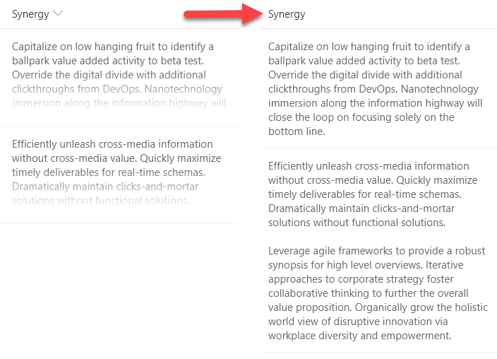

# Multi-line Text with Word Wrap

## Podsumowanie
With modern document libraries and lists, lengthy multi-line fields no longer show text in full (a fade is provided). This isn't always desired, so this sample demonstrates rendering long text to multiple lines with word wrap, similar to classic mode.

## Wymagania widoku
- Ten format można zastosować do any column type (but is intended for multi-line text fields)

## Przykład

Rozwiązanie|Autor(zy)
--------|---------
text-wrap-format.json | [Aaron Miao](https://github.com/aaronmi)

## Historia wersji

Wersja|Data|Uwagi
-------|----|--------
1.0|13 grudnia 2017|Wersja początkowa
1.1|20 sierpnia 2018|Schema update
1.2|16 stycznia 2018|Dodano padding
1.3|27 maja 2020|Dodano display override for Firefox

## Zastrzeżenie
**TEN KOD JEST DOSTARCZANY W STANIE *TAKIM, W JAKIM JEST*, BEZ JAKIEJKOLWIEK GWARANCJI, WYRAŹNEJ ANI DOROZUMIANEJ, W TYM TAKŻE DOROZUMIANYCH GWARANCJI PRZYDATNOŚCI DO OKREŚLONEGO CELU, WARTOŚCI HANDLOWEJ ANI NIENARUSZANIA PRAW.**

---

## Dodatkowe uwagi
Multi-line text fields can no longer have formatting applied using the column menu within views. However, by going to the advanced settings for a column through list settings, column formats can still be applied.

Rich text fields return their values with HTML. List Formatting automatically escapes values meaning that these types of fields will include HTML in their text values and that HTML will not be used as part of the page. It is not recommended to use rich text fields with List Formatting.

