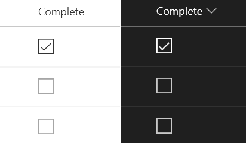
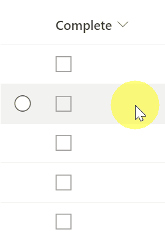

# Yes/No Checkbox

## Podsumowanie
Ta próbka wykorzystuje [Office UI Fabric](https://developer.microsoft.com/en-us/fabric) icons and theme classes to provide a better visualization for Yes/No fields while respecting theme colors.

The icons and theme colors are conditionally applied based on the field's value. By using the `ms-fontColor` classes, the icon works well in both light and dark themes (as well as custom themes). In addition, regardless of value, the `ms-fontSize-l` class is applied to make the icon large enough to stand on its own.

|Value|Class|Icon|
|---|---|---|
|Yes|ms-fontColor-neutralPrimary|CheckboxComposite|
|No|ms-fontColor-neutralTertiary|Checkbox|

Also, this sample uses the `setValue` of `customRowAction` to update the field. Musisz set the `actionInput` to the internal name of the column to be updated.

## Wymagania widoku
- Ten format można zastosować do a Yes/No column

## Przykład

Rozwiązanie|Autor(zy)
--------|---------
yesno-checkbox.json | [Chris Kent](https://github.com/thechriskent), [Tetsuya Kawahara](https://github.com/tecchan1107)

## Historia wersji

Wersja|Data|Uwagi
-------|----|--------
1.0|18 sierpnia 2018|Wersja początkowa
1.1|21 listopada 2021|Modified to update item using `setValue`
1.2|29 października 2023|Changed CSS class so that a checkbox also appears in SharePoint Server 2019

## Zastrzeżenie
**TEN KOD JEST DOSTARCZANY W STANIE *TAKIM, W JAKIM JEST*, BEZ JAKIEJKOLWIEK GWARANCJI, WYRAŹNEJ ANI DOROZUMIANEJ, W TYM TAKŻE DOROZUMIANYCH GWARANCJI PRZYDATNOŚCI DO OKREŚLONEGO CELU, WARTOŚCI HANDLOWEJ ANI NIENARUSZANIA PRAW.**

---

## Dodatkowe uwagi

> Dodatkowa wersja wykorzystująca Abstract Tree Syntax (AST) jest również dostępna dla środowisk, w których wyrażenia w stylu Excela nie są obsługiwane.

