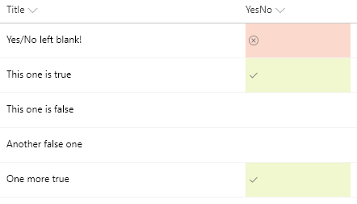

# Formatting Yes/No field to check mark based on the value in the field

## Podsumowanie
Możesz zastosować formatowanie warunkowe do Yes/No fields. Ta próbka stosuje different classes depending on whether the value of the field is Yes (true), No (false), or Blank. This example applies one of the column formatting [predefined classes](https://docs.microsoft.com/en-us/sharepoint/dev/declarative-customization/column-formatting#predefined-classes) (`sp-field-severity--good`,`sp-field-severity--low`, or `sp-field-severity--blocked`) to the root `
` based on the field's value. This is what determines the element's background color. A class of `ms-fontColor-neutralSecondary` is always applied to ensure the text color is legible in both light and dark themes. Then, it outputs a `` element with an `iconName` attribute that shows a [Fluent UI](https://developer.microsoft.com/en-us/fabric#/styles/icons) icon inside that element.

|Value|Class|Icon|
|---|---|---|
|Yes|sp-field-severity--good|Checkmark|
|No|sp-field-severity--low||
|Blank|sp-field-severity--blocked|ErrorBadge|

> Note: the `sp-field-severity--low` class has a transparent background and since no icon is shown, it is expected that false values will appear to have no display

## Wymagania widoku
- Ten format można zastosować do a Yes/No column

## Przykład

Rozwiązanie|Autor(zy)
--------|---------
yesno-checkmark-format.json | [Aaron Miao](https://github.com/aaronmi)

## Historia wersji

Wersja|Data|Uwagi
-------|----|--------
1.0|November 22, 2017|Wersja początkowa
1.1|March 22, 2018|Simplified logic and added blank value icon
1.2|August 20, 2018|Switched to Excel-style expression and added theme fontColor

## Zastrzeżenie
**TEN KOD JEST DOSTARCZANY W STANIE *TAKIM, W JAKIM JEST*, BEZ JAKIEJKOLWIEK GWARANCJI, WYRAŹNEJ ANI DOROZUMIANEJ, W TYM TAKŻE DOROZUMIANYCH GWARANCJI PRZYDATNOŚCI DO OKREŚLONEGO CELU, WARTOŚCI HANDLOWEJ ANI NIENARUSZANIA PRAW.**

---

## Dodatkowe uwagi

> An additional version using Abstract Tree Syntax (AST) is also provided for environments where the Excel-style expressions are not supported.

