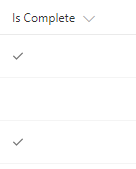

# Yes/No Column Check Mark

## Podsumowanie
This example displays a check mark when the value of a Yes/No column is equal to Yes. This field uses the `iconName` attribute to display the `CheckMark` [Office UI Fabric predefined icon](https://developer.microsoft.com/en-us/fabric#/styles/icons).

## Wymagania widoku
- Ten format można zastosować do a Yes/No column

## Przykład

Rozwiązanie|Autor(zy)
--------|---------
yesno-checkmark.json | [Travis Lingenfelder](https://github.com/Travis-Constellation)

## Historia wersji

Wersja|Data|Uwagi
-------|----|--------
1.0|27 listopada 2017|Wersja początkowa
1.1|22 marca 2018|Uproszczono logikę
1.2|20 sierpnia 2018|Przełączono na wyrażenie w stylu Excela

## Zastrzeżenie
**TEN KOD JEST DOSTARCZANY W STANIE *TAKIM, W JAKIM JEST*, BEZ JAKIEJKOLWIEK GWARANCJI, WYRAŹNEJ ANI DOROZUMIANEJ, W TYM TAKŻE DOROZUMIANYCH GWARANCJI PRZYDATNOŚCI DO OKREŚLONEGO CELU, WARTOŚCI HANDLOWEJ ANI NIENARUSZANIA PRAW.**

---

## Dodatkowe uwagi

For more information on using this custom formatting see the article [Check Mark SharePoint Modern List Column Format](http://www.constellationsolutions.com/how-to/check-mark-sharepoint-modern-list-column-format/)

> Dodatkowa wersja wykorzystująca Abstract Tree Syntax (AST) jest również dostępna dla środowisk, w których wyrażenia w stylu Excela nie są obsługiwane.

