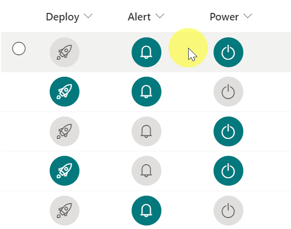

# Yes/No Icon Color

## Podsumowanie
Ta próbka pokazuje how to change the color of the icon according to the value of the Yes/No column. Also, this sample uses the `setValue` of `customRowAction` to update the field. Musisz set the `actionInput` to the internal name of the column to be updated.

## Wymagania widoku
Ten format można zastosować do a Yes/No column.

## Przykład

Rozwiązanie|Autor(zy)
--------|---------
yesno-icon-color.json | [Tetsuya Kawahara](https://github.com/tecchan1107)

## Historia wersji

Wersja |Data              |Uwagi
--------|------------------|--------
1.0     |grudnia 11, 2021 |Wersja początkowa

## Zastrzeżenie
**TEN KOD JEST DOSTARCZANY W STANIE *TAKIM, W JAKIM JEST*, BEZ JAKIEJKOLWIEK GWARANCJI, WYRAŹNEJ ANI DOROZUMIANEJ, W TYM TAKŻE DOROZUMIANYCH GWARANCJI PRZYDATNOŚCI DO OKREŚLONEGO CELU, WARTOŚCI HANDLOWEJ ANI NIENARUSZANIA PRAW.**

---

## Dodatkowe uwagi

- [Fluent UI Icons](https://developer.microsoft.com/en-us/fluentui#/styles/web/icons)

