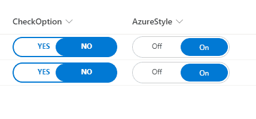

# Rounded fill checkbox

## Podsumowanie
Ta próbka zawiera custom checkbox rounded styles.

## Wymagania widoku
- Format expects the following fields:

Pole |Typ
--------|---------
Title | Pojedyncza linia tekstu 
CheckOption | Yes/No - field with rounded style
AzureOption | Yes/No - field with Azure look style

## Przykład

Rozwiązanie|Autor(zy)
--------|---------
yesno-roundedfill-format.json | [André Lage](https://github.com/aaclage)
yesno-azure-format.json | [André Lage](https://github.com/aaclage)

## Historia wersji

Wersja|Data|Uwagi
-------|----|--------
1.0|07 stycznia 2022|Wersja początkowa

## Zastrzeżenie
**TEN KOD JEST DOSTARCZANY W STANIE *TAKIM, W JAKIM JEST*, BEZ JAKIEJKOLWIEK GWARANCJI, WYRAŹNEJ ANI DOROZUMIANEJ, W TYM TAKŻE DOROZUMIANYCH GWARANCJI PRZYDATNOŚCI DO OKREŚLONEGO CELU, WARTOŚCI HANDLOWEJ ANI NIENARUSZANIA PRAW.**

